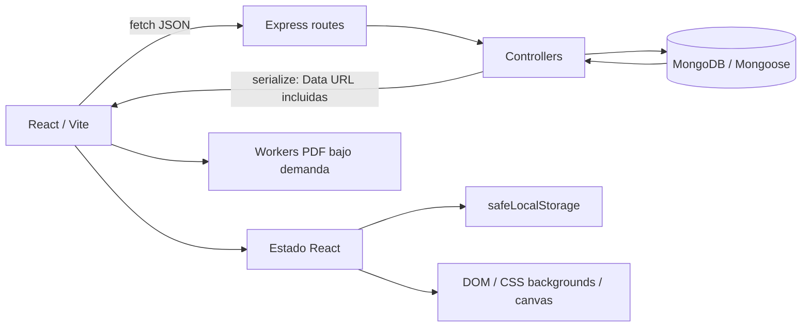
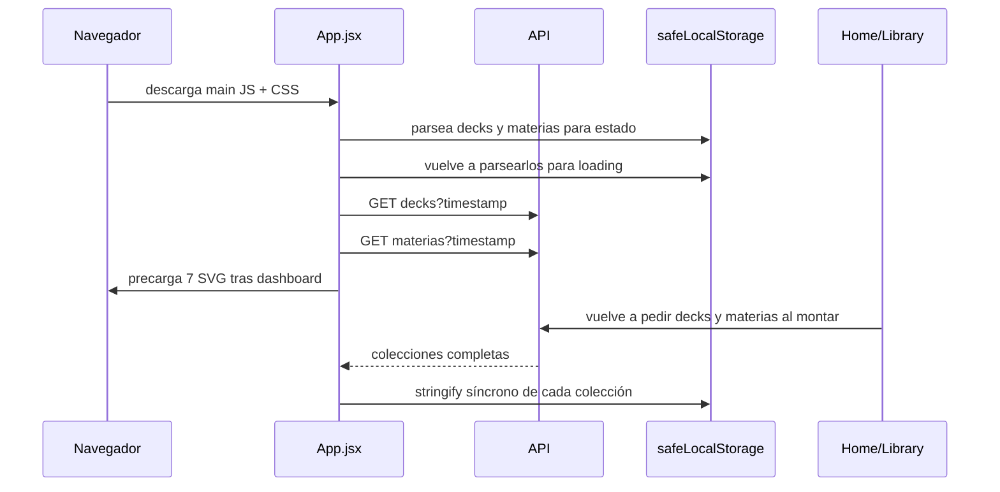
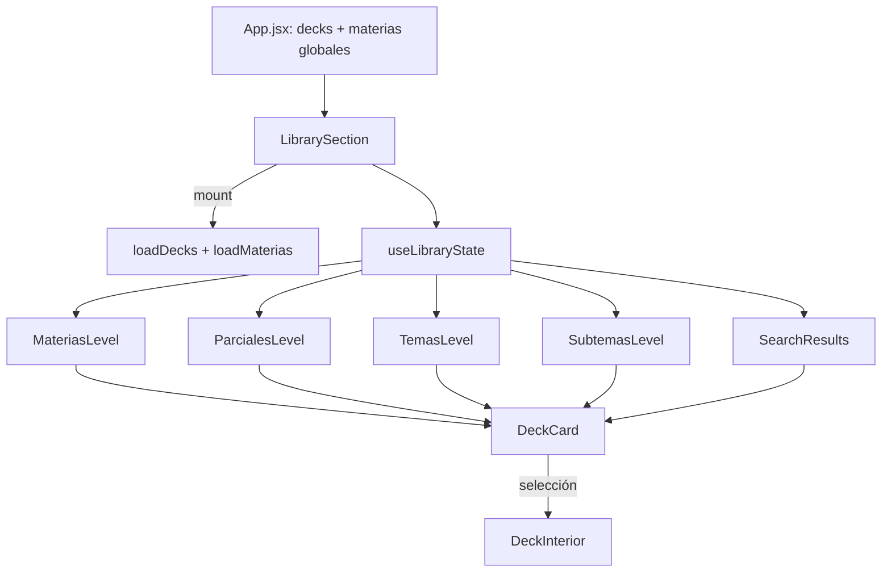
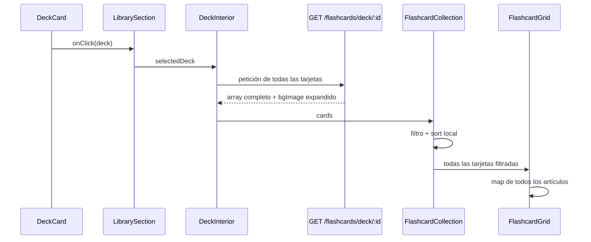
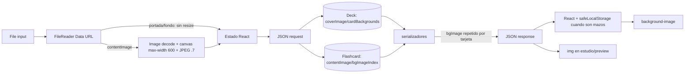

# Arquitectura y flujos críticos observados

## Convenciones de evidencia

- **Hecho**: recorrido confirmado en productores, consumidores, ruta y serializador.
- **Inferencia**: consecuencia técnica directa, sin métrica de entorno real.
- **Hipótesis**: requiere perfil, plan de consulta, dispositivo o dataset.
- Las líneas son aproximadas para el HEAD auditado `6b1492c9bed57dbfe15537d5a8cbe1424f01c12f`.

## Vista de arquitectura



El frontend usa estado local elevado en `App.jsx` para `decks` y `materias`; no se observó una capa de consulta con normalización, deduplicación o caché por clave. `safeLocalStorage` intenta proteger frente a excepciones de cuota con un Map en memoria y serializa de manera síncrona el valor completo. Sin embargo, `getJSON` no consulta ese Map cuando la clave falta o conserva un JSON antiguo válido, de modo que el fallback no garantiza recuperar el último valor. El backend usa documentos Mongoose y serializadores propios. Las imágenes viajan dentro de JSON como Data URL en vez de tener URLs cacheables independientes.

## Carga inicial de la aplicación



Evidencia:

- `frontend/src/App.jsx:8-20` importa estáticamente Home, Study, Library, General, Settings y Users. Sólo `DebugPanel` se carga con `lazy` (`App.jsx:22`). Las condiciones de render no dividen el bundle.
- `App.jsx:61-69` inicializa `decks`, `materias` y `loading`; los dos valores persistidos se parsean dos veces durante la inicialización.
- `App.jsx:81-129` lanza mazos y materias al montar con `AbortController`. Cada URL añade `t=Date.now()` y cada respuesta reemplaza estado y persistencia completa.
- `HomeSection.jsx:487-490` vuelve a llamar ambos loaders al montar. `LibrarySection.jsx:31-34` hace lo mismo. Son consumidores reales, no funciones huérfanas.
- `App.jsx:398-409,432-433,474-488` mantiene una capa de carga con duración configurada de 2,500 ms tras login. Es una espera mínima configurada; no es un tiempo de red medido.
- `App.jsx:74-76` llama `preloadStaticIllustrations`. `frontend/src/lib/staticIllustrations.js` importa siete SVG y crea objetos `Image`/`decode`; el build muestra aproximadamente 102 kB sin comprimir entre esos SVG. Se descargan después de entrar al dashboard, aunque la sección que los use no se abra.
- `frontend/src/index.css:1` usa `@import` externo de Google Fonts para Plus Jakarta Sans, pesos 400–800. La latencia y política de caché reales no se midieron.

El build de producción contiene un único entry principal de 900.65 kB minificado (246.33 kB gzip) y CSS de 156.15 kB (24.51 kB gzip). Búsquedas dentro del artefacto confirman rutas de flashcards, `all-cards` e IA en el chunk principal. PDF es la excepción importante: `PdfExtractor`, renderizadores y workers están divididos y se descargan bajo demanda.

## Navegación por Library



### Entrada y colección general

`loadDecks` solicita `GET /api/decks/:userId?t=...`. La función `getDecks` de `backend/src/controllers/deckController.js` construye una consulta que incluye los mazos propios más los globales default/read-only visibles, acepta filtros académicos opcionales, ordena por `createdAt`, y después agrega conteos sobre `Flashcard`. No usa proyección ni `lean()`. La respuesta llama `Deck.serialize()` para cada documento, incluyendo portada y todos los fondos.

El frontend principal no usa los filtros académicos: conserva la colección general y filtra localmente. Esto es parcialmente intencional —permite navegación inmediata entre niveles ya descargados— pero hace crecer el coste inicial con todo el catálogo visible y transporta campos que cada pantalla no necesita.

### Materias, temas y subtemas

- `useLibraryState.js:57-58` mantiene cachés `Map` de temas y subtemas dentro del montaje actual.
- `useLibraryState.js:80-144` pide `GET /api/academic/temas` y `GET /api/academic/subtemas` bajo demanda. No hay `AbortController` ni token de secuencia; respuestas antiguas pueden actualizar el estado después de una navegación rápida.
- Las cachés son útiles durante un montaje, pero se pierden al desmontar Library y no tienen edad, versión ni invalidación ligada a mutaciones.
- `processedDecks` (`useLibraryState.js:146-176`) filtra y ordena toda la colección.
- Al ordenar carpetas por cantidad, `sortedMaterias`, `sortedTemas` y `sortedSubtemas` vuelven a filtrar mazos por cada elemento (`useLibraryState.js:27-37,179-188`).
- `TemasLevel.jsx:27-28,61-62` y `SubtemasLevel.jsx:43-44,75-76` calculan conteos con `decks.filter(...)` dentro de `.map(...)`: coste O(carpetas × mazos).
- `SearchResults` recorre colecciones y resuelve relaciones con búsquedas anidadas. Además, temas/subtemas sólo abarcan los niveles cargados en memoria; por tanto la búsqueda académica no es un índice global.
- `MateriasLevel` limita inicialmente las carpetas visibles en móvil/escritorio, pero las listas de mazos no tienen paginación ni virtualización. `SearchResults` tampoco.
- `DeckCard` no está memoizado y recibe callbacks/objetos creados por el padre. Cualquier cambio de estado del nivel reconstruye todas las tarjetas visibles. Esto es coste confirmado de render; su duración está pendiente de React Profiler.

### Reutilización e invalidación

La colección global de mazos sí se reutiliza para filtros locales, una decisión coherente con una biblioteca pequeña. Sin embargo:

- el timestamp vuelve únicas las URL;
- montar Home o Library revalida sin deduplicar la petición de App;
- volver hacia niveles superiores puede invocar ambas cargas;
- crear/editar/eliminar/importar dispara ambas cargas;
- varias cargas simultáneas pueden completarse fuera de orden;
- una sola bandera `loading` puede pasar a falso cuando termina la primera de las dos peticiones;
- los errores de App se absorben y dejan datos previos sin indicador de antigüedad.

## Apertura de un mazo



`frontend/src/components/DeckInterior.jsx:59-84` solicita todas las tarjetas al montar y cancela esa petición al desmontar. No hay caché por mazo: reabrir repite red, consulta, parseo y decodificaciones asociadas. En modo editable el formulario puede aparecer mientras carga; en modo de sólo lectura la colección muestra skeleton.

`FlashcardCollection.jsx:48-66` usa `useDeferredValue` para que el texto de búsqueda responda mejor, pero vuelve a filtrar y ordenar la lista completa. `FlashcardGrid.jsx:123-202` monta todos los resultados en dos columnas; no hay ventana, página ni `content-visibility` explícito.

Para 20/100/500/1000 tarjetas no se inventa un tiempo. El crecimiento demostrado es:

- respuesta y JSON: O(n), con multiplicador del tamaño de `bgImage`/`contentImage`;
- filtro: O(n); ordenamiento: O(n log n);
- nodos y fondos CSS: O(n);
- creación de estilos/presentación: O(n) por render de la cuadrícula.

### Diferencias entre colección, repaso y sesión

- La colección reutiliza la primera respuesta de `DeckInterior`.
- `ReviewMode` simple consume el mismo estado de tarjetas.
- Los modos de sesión montan `SessionPlayer`, que inicia sesión y pide `GET /api/decks/:id/all-cards?userId=...` (`SessionPlayer.jsx:370-390,425-462`). `DeckInterior` no evita su propia carga previa, por lo que se descargan dos colecciones completas.
- Dentro de una sesión, `SessionPlayer` guarda `allCardsRef` y forma lotes localmente. Esa reutilización es intencional y evita peticiones por lote.
- `StudySection` puede volver a pedir las tarjetas de un mazo para exportación.

## Creación y edición rápida

```mermaid
sequenceDiagram
    participant U as Usuario
    participant F as FlashcardCreator/FormInputs
    participant M as ManualCardEditorModal
    participant D as DeckInterior.handleSubmit
    participant API as flashcardController
    participant DB as MongoDB
    participant A as App loaders

    U->>F: escribe/selecciona imagen
    F->>F: estado controlado; canvas si contentImage
    M->>D: Guardar
    D->>API: POST/PUT JSON con Data URL
    API->>DB: fondo: buscar/guardar Deck
    API->>DB: crear/actualizar Flashcard
    API->>DB: volver a buscar Deck para serializar
    DB-->>API: documentos
    API-->>D: tarjeta con bgImage expandido
    D->>D: actualiza cards y limpia formulario
    D->>A: onRefreshData()
    A->>API: GET decks + GET materias
    API-->>A: colecciones completas
    A->>A: setState + safeLocalStorage
```

`DeckInterior.jsx:184-271` pone `saving`, espera `fetch`, parsea la respuesta, actualiza `cards`, resetea el formulario y después invoca `onRefreshData`. Hasta la respuesta, la siguiente tarjeta no tiene un formulario limpio. La lista local no se vuelve a descargar, lo cual evita una petición de tarjetas adicional, pero el refresco global de mazos/materias continúa en segundo plano.

Operaciones observadas para creación individual:

| Variante | Operaciones principales y secuencia |
|---|---|
| Sin fondo nuevo | `Flashcard.create` → `Deck.findById` para serializar |
| Fondo ya existente | `Deck.findById`/`indexOf` → `Flashcard.create` → `Deck.findById` |
| Fondo nuevo | `Deck.findById` → `Deck.save` → `Flashcard.create` → `Deck.findById` |

La actualización añade lectura de la tarjeta actual y `findByIdAndUpdate`; con fondo nuevo puede alcanzar cinco operaciones secuenciales. Después llegan `Deck.find` + agregación de conteos y `Materia.find` por `onRefreshData`. No hay medición de latencia DB; la tabla refleja llamadas observadas.

El editor manual mantiene textareas controladas. Cada pulsación propaga pregunta/respuesta al estado propietario de `DeckInterior`, por lo que puede renderizar el subárbol del creador. La arquitectura V2 retiró problemas previos de listeners/scroll según `docs/platform-limitations/`; la duración real de cada commit de React, foco e IME en móvil está pendiente de perfil.

La creación por lote usa `insertMany`, una lectura/guardado de fondos y una respuesta conjunta; reduce round trips de DB frente a repetir el endpoint individual. Sin embargo, el controlador fija `contentImage: ''` en los documentos importados aunque el frontend incluya ese campo, divergencia de contrato confirmada que puede provocar pérdida silenciosa de imágenes.

## Almacenamiento y entrega de imágenes



El detalle completo está en [image-pipeline.md](./image-pipeline.md). Las decisiones fundamentales confirmadas son:

- portada: `DeckModal.jsx:7-52`, Data URL completa, límite de archivo de 1.5 MB, sin resize;
- fondo: `FlashcardCreator.jsx:245-255`, Data URL completa, límite de 700 kB, sin resize;
- contenido: `FlashcardCreator.jsx:258-293`, decodificación y canvas en hilo principal, ancho máximo 600 px, JPEG 0.7;
- persistencia: `Deck.js:11-12` guarda portada/fondos; `Flashcard.js:22,25` guarda índice y contenido;
- expansión: `Flashcard.serialize():58-79` convierte índice a cadena `bgImage` por tarjeta;
- catálogo: `Deck.serialize():38-66` incluye portada y fondos en cada mazo;
- grid: `DeckCard` y `FlashcardGrid` usan fondos CSS, sin semántica de `loading="lazy"` o `decoding="async"`.

La codificación Base64 incrementa teóricamente los bytes binarios cerca de 4/3 antes del prefijo y del envoltorio JSON. No se estima el heap multiplicando por dos: la representación interna y deduplicación dependen del motor y deben medirse.

## Inventario de endpoints críticos

| Endpoint | Consumidor principal | Datos/trabajo | Límite/caché/cancelación observada |
|---|---|---|---|
| `GET /api/decks/:userId` | App/Home/Library | todos los mazos visibles + aggregate de conteos + imágenes | filtros disponibles; frontend general no los usa; timestamp; AbortController sólo en algunas llamadas |
| `GET /api/academic/materias/:userId` | App/Home/Library | materias completas, incluida estructura de criterios serializada | colección completa; timestamp; persistida completa |
| `GET /api/academic/temas/:materiaId` | `useLibraryState` | temas y conteos agregados de subtemas | caché Map por montaje; sin abort/orden |
| `GET /api/academic/subtemas/:temaId` | `useLibraryState` | subtemas | caché Map por montaje; sin abort/orden |
| `GET /api/flashcards/deck/:deckId` | `DeckInterior`, export | todas las tarjetas + imágenes expandidas | sin página ni caché por mazo; abort en montaje principal |
| `POST /api/flashcards` | `DeckInterior` | tarjeta individual, Data URL opcionales | espera respuesta; operaciones DB secuenciales |
| `PUT /api/flashcards/:id` | `DeckInterior` | tarjeta completa editada | espera respuesta; operaciones DB secuenciales |
| `POST /api/flashcards/bulk` | importación | lote completo | `insertMany`; descarta `contentImage`; respuesta completa |
| `GET /api/decks/:id/all-cards` | `SessionPlayer` | todas las tarjetas + stats/contexto | duplica carga de `DeckInterior` al abrir sesión |
| `POST /api/reviews` | modos de estudio | actualización, log y encolado de cascada | cola por usuario en memoria; cascada vuelve a leer todas las tarjetas |
| endpoints de sesión | `SessionPlayer` | inicio, update, close/flush | caché `allCardsRef` por montaje; flush puede exponer backlog |
| export/import deck | Library/DeckInterior | mazo + tarjetas + imágenes | export conserva índice de fondo; import recrea fondos una vez |

Los endpoints legacy de sesión continua/normal permanecen en backend pero no se encontraron como consumidores frontend actuales; representan superficie duplicada, no carga inicial ejecutada.

## Inventario de estados, cachés y persistencia

| Ubicación | Contenido | Vida | Observación |
|---|---|---|---|
| `App.decks` | mazos serializados completos | sesión React | fuente compartida Home/Library |
| `App.materias` | materias completas | sesión React | incluye campos no requeridos por todas las vistas |
| `safeLocalStorage` | copias JSON completas | persistente + Map en memoria | parse/stringify síncrono; sin TTL/esquema/evicción; recuperación del Map incompleta |
| `useLibraryState` Maps | temas/subtemas por clave | montaje de Library | evita repetición local; sin invalidación ni protección de orden |
| `DeckInterior.cards` | tarjetas completas de un mazo | montaje | sin caché entre reaperturas |
| `SessionPlayer.allCardsRef` | todas las tarjetas de sesión | montaje de sesión | reutilización intencional de lotes |
| PDF image cache | recursos de imagen por source | trabajo PDF | deduplica fuentes y cierra `ImageBitmap`; control positivo |
| cola de reviews backend | Promise por usuario | proceso Node | serializa cascadas; no coordina instancias ni limpia claves observadas |

## Consultas e índices observados

- `Deck`: índices simples para `userId`, `materia`, `parcial`, `tema`, `subtema` y combinaciones de mastery/usuario. La consulta general también filtra flags globales y ordena `createdAt`; no se observó índice compuesto que cubra ese patrón.
- `Flashcard`: índices simples de `userId`, `deckId` y `difficulty`. La carga por mazo ordena por creación; no se observó compuesto `{ deckId, createdAt }`.
- `ReviewLog`: sí posee índices compuestos orientados a usuario/fecha/mazo.
- `getDecks` y temas ejecutan agregaciones de conteo además de la lectura principal.
- `registerReview` actualiza tarjeta y log, luego encola una cascada que vuelve a cargar todas las tarjetas del mazo, guarda el Deck y puede recorrer relaciones superiores. El coste se repite por respuesta estudiada.

La adecuación real de los índices es una hipótesis fuerte, no una conclusión de plan: falta `explain("executionStats")` con cardinalidades representativas.

## Recursos, listeners y limpieza

- La petición principal de tarjetas y las iniciales de App usan abort al desmontar; las de temas/subtemas y varios refrescos secundarios no.
- `ImageActionSheet` crea una Object URL de preview y la revoca al cambiar/desmontar: no se encontró fuga allí.
- El procesamiento PDF cierra `ImageBitmap` cuando lo crea y usa caché por fuente.
- No se encontraron atributos `loading="lazy"` o `decoding="async"` en imágenes raster del flujo auditado; los fondos CSS no pueden usar dichos atributos.
- Las imágenes de contenido en estudio/preview no declaran dimensiones intrínsecas desde el modelo, por lo que el espacio reservado y layout shift requieren validación visual.
- Las limitaciones de listeners, focus y scroll del editor se rigen por la documentación V2 existente; las pruebas físicas posteriores al drift actual siguen pendientes.
