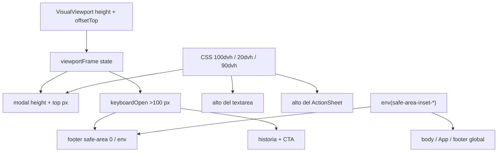
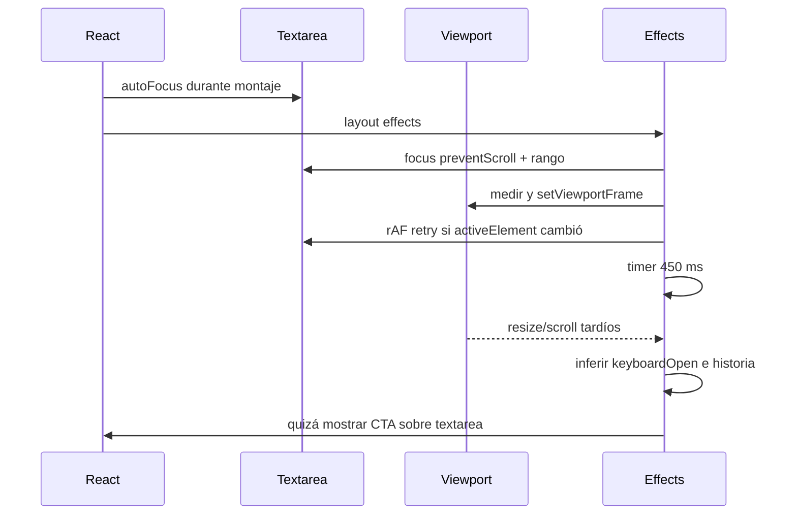
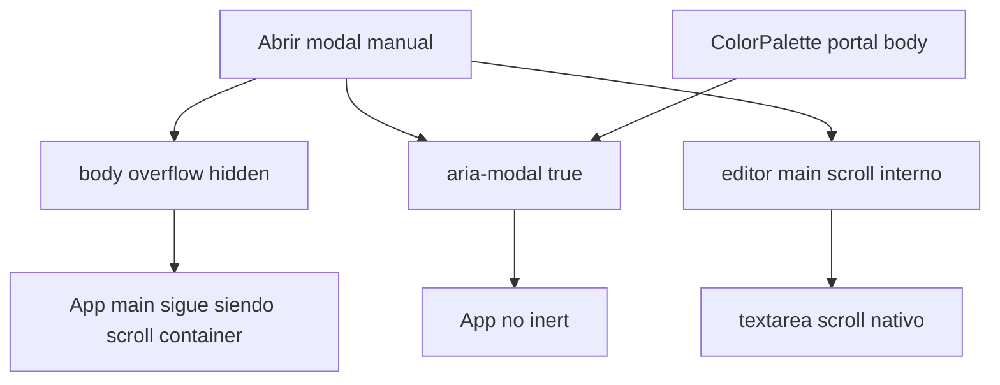

# Matriz de conflictos del editor manual

**Commit auditado:** `bc541f930f7fc6e3eb055adb0cb4a232d5099b5c`.  
**Objetivo:** localizar múltiples fuentes de verdad y efectos que compiten. Este documento no implementa ni prescribe APIs concretas de V2.

## 1. Resumen

Hay seis conflictos sistémicos:

1. **Geometría:** VisualViewport en píxeles, `100dvh`/`20dvh`, layout viewport y safe-area toman decisiones diferentes.
2. **“Teclado”:** dos detectores con baseline/tiempo distintos y refs de historia intentan producir una verdad que la plataforma no ofrece.
3. **Foco:** `autoFocus`, layout effect, rAF, timers y restauradores independientes compiten con UI nativa.
4. **Overlay:** portal, absoluto inline y sheet fixed tienen capas, ámbitos modales y cierres independientes.
5. **Scroll:** el modal bloquea body directamente, `ActionSheet` usa propietarios, pero el scroll owner de fondo es App `<main>`.
6. **Lifecycle:** color/archivo se infieren desde blur, focus y timeouts; ninguno es un evento universal de “picker cerrado”.

## 2. Conflicto geométrico principal

El modal completo sigue `VisualViewport.height` cuando existe, pero una caja interna conserva `20dvh`, el fallback usa `100dvh` y el `ActionSheet` usa `90dvh`. A la vez, el mismo booleano inferido decide retirar el inset inferior. Por ello, dos superficies pueden responder de forma distinta al mismo cambio de navegador.

## 3. Matriz de fuentes de verdad

| Dominio | Fuente A | Fuente B/C que compite | Resultado actual posible | Autoridad conceptual única |
|---|---|---|---|---|
| Altura visible | `visualViewport.height` → estado px | `100dvh`, `20dvh`, `90dvh`; fallback `innerHeight` | Marco sigue OSK/toolbar pero textarea y sheet siguen otra métrica. | `EditorGeometrySnapshot`; CSS consume variables derivadas cuando deba seguir esa superficie. |
| Baseline | altura inicial + máximo histórico | altura layout leída de nuevo tras 450 ms | Orientación/toolbar se interpretan distinto entre detector inicial y runtime. | Snapshots por fase/orientación; sin máximo histórico universal. |
| Teclado | `height < layoutHeight - 100` | focus/touch + `keyboardWasOpenRef` + `resumeRequestedRef` | `keyboardOpen` true sin OSK o CTA obsoleto sin nuevo render. | Ninguna verdad de teclado; intención + geometría/confianza separadas. |
| Safe-area inferior | `env(safe-area-inset-bottom)` | `keyboardOpen ? 0` | Falso positivo retira protección; falso negativo deja hueco sobre OSK iOS. | `SafeAreaContract` por borde y estado observable degradable. |
| Safe-area global | body top/bottom | App top, footer global bottom, modal top/bottom, sheet bottom | Ownership no documentado; riesgo de sumar/omitir al cambiar composición. | Un propietario por borde y superficie; portales no heredan ownership geométrico. |
| Foco inicial | JSX `autoFocus` | layout effect inmediato + rAF retry + timer CTA | llamadas redundantes; rAF no recupera activación iOS. | `InputSession` decide una sola estrategia según evento de apertura. |
| Retorno de foco | restaurador del modal | restaurador de `StylePanel`; restaurador de `ActionSheet` | targets/rAF/cleanup pueden competir en cierres anidados. | `OverlayStack` restaura exactamente al propietario al retirar la capa superior. |
| OSK | foco DOM del textarea | reducción de viewport inferida | textarea puede ser `activeElement` sin OSK en iOS/teclado físico. | Estado OSK permanece `unknown`; solo acción explícita puede pedir foco. |
| Selección | un `selectionRef` | contenido alterna entre question/answer | rango de un lado se aplica al otro; no hay `selectionDirection` ni clamp. | `InputSession[side]` con rango/dirección validado. |
| Color picker | `showPicker()` si existe | `click()` fallback en el mismo `pointerdown` | falta activación touch/teclado; rechazo depende del motor. | Acción semántica única dentro de activación; capability detection. |
| Cierre color | `change` | `blur + 80 ms`; click de backdrop; Escape local/global | cancelación puede no cerrar; Escape puede cerrar padre; timer llega tarde. | `PickerTransaction` + acción de salida explícita; no una señal universal ficticia. |
| File picker | `change` | `window.focus + 250 ms` | multitarea/focus se confunde con cancelación; ref cambia sin render. | Transacción de archivo; focus solo indicio. |
| Menú | `openMenu` state | `openMenuRef` + guardia 450 ms | DOM cerrado pero historia de input pendiente; timer no publica transición. | Reducer/estado explícito de overlay/picker. |
| Posición color | rects + VisualViewport width/offset | CSS `max-width: 100vw`; ancho calculado no escrito | la caja real puede superar el clamp usado para `left`. | Posicionador único que escribe tamaño y posición efectivos. |
| Posición alineación | `absolute` relativo a toolbar | backdrop `fixed`; ancestros hidden | popup recortado o fuera de visual viewport. | Mismo primitive/root/geometry que color. |
| Capas | z-index hardcoded | stacking contexts/portals distintos | mismo número no representa misma profundidad; hijo puede no cerrar primero. | `OverlayStack` asigna capa por orden/propiedad. |
| Modalidad | `aria-modal=true` | foco conservado detrás, sin `inert`, portales fuera | visualmente modal, árbol de foco no modal. | Ámbito modal que incluye overlays descendientes. |
| Escape | window listener manual | window listener por ActionSheet + listener local palette | varias capas cierran o la capa equivocada gana. | Solo la capa superior consume Escape/Back. |
| Scroll lock | escritura inline del modal | `scrollLock` owner-set de ActionSheet | cleanup puede restaurar body mientras otro owner existe. | `ScrollLease` único. |
| Scroll root | body bloqueado | App `<main overflow-y-auto>` | el fondo real puede seguir desplazándose/focable. | Lease sobre App main + `inert`; body solo si realmente es scroller. |
| Entrada a edición | `window.scrollTo(...smooth)` en `DeckInterior` | autoapertura/foco/medición del modal al cambiar `editingId` | el fondo anima mientras nace el portal; en móvil se desplaza el target equivocado. | Transición coordinada con el scroll owner antes de adquirir la modalidad. |
| Reflow | listeners directos del modal | rAF de paleta + scroll capture + observers | renders/mediciones por píxel; lecturas duplicadas del mismo viewport. | Un snapshot de geometría y posicionadores que comparan resultado. |
| Altura footer padre | `ResizeObserver` opcional | ningún caller de `onFooterHeightChange` | contrato muerto parece fuente de layout disponible. | Eliminar o conectar solo a la autoridad geométrica demostrada. |
| Hook teclado compartido | diff `innerHeight-clientHeight` y `>80` | detector manual VisualViewport `>100` | dos semánticas incompatibles si se conectan; hoy están separadas. | No importar; migración aparte de consumidores existentes. |

## 4. Efectos que compiten en una apertura

No hay un orden portable que convierta esta secuencia en una prueba de OSK. En React StrictMode de desarrollo, los ciclos de effect setup/cleanup hacen todavía más importante que cada efecto sea idempotente; el defecto de producción sigue siendo la pluralidad de autoridades, no StrictMode.

## 5. Conflictos por navegador

| Secuencia | Safari/WebKit iOS | Chrome Android | Android WebView | Consecuencia arquitectónica |
|---|---|---|---|---|
| Foco diferido tras cerrar picker | Puede dejar foco DOM sin abrir OSK (`WK-195884`). | Suele enfocar, pero `preventScroll` puede ignorarse. | Depende del host/IME; `preventScroll` también puede ignorarse. | El retorno no puede prometer OSK ni ausencia de movimiento. |
| VisualViewport al animar OSK | Eventos/valores pueden llegar tarde (`WK-265578`). | Normalmente cambia, con políticas resize distintas. | Antes de M139 puede no cambiar de forma independiente (`CR-40287394`). | Aceptar `settling/unknown`; segunda lectura y degradación con scroll. |
| Safe-area inferior con OSK | Puede seguir no-cero (`WK-217754`). | Insets/edge-to-edge dependen de configuración. | Dependen del wrapper y host. | No usar un booleano de teclado como contrato global de inset. |
| Body scroll lock + OSK | Bug de salto/desplazamiento (`WK-240860`). | Body puede no ser scroll root del SPA. | Igual, condicionado por host. | Bloquear el propietario real, mantener scroll interno. |
| `showPicker()` color | No es portable; fallback nativo puede cerrar OSK. | Disponible sujeto a activación transitoria. | Versión/capacidad del motor embebido. | Feature detection + evento activador válido + transacción. |
| Touch custom en `pointerdown` | Fallback puede parecer funcionar, sin contrato. | `showPicker()` puede rechazar antes de `pointerup`. | Igual, según versión. | El bug de evento es propio, no una incompatibilidad que deba sniffearse. |
| Back | Gesto/history del shell. | Botón/gesto Back es interacción primaria. | El host puede interceptarlo. | Un único adaptador de navegación para la capa superior. |

## 6. Conflicto de scroll y modalidad

El scroll interno de editor/textarea es correcto. El conflicto es que el lock se aplica a otro nodo y la modalidad accesible no se aplica al fondo. Un `touchmove.preventDefault` global resolvería el síntoma equivocado y rompería los dos scrolls que sí deben existir.

## 7. Conflicto de overlays

| Superficie | Posición | Portal | Escape | Foco | Scroll | Safe-area |
|---|---|---|---|---|---|---|
| Modal manual | fixed según VV | body | window, cierra modal | autoFocus/effects; sin trap/restore | main interno | top; bottom heurístico |
| Menú alineación | absolute | no | hereda Escape del modal | conserva textarea | ninguno | no |
| ColorPalette | fixed medido | body | local, normalmente sin foco | intenta conservar/restaurar target | horizontal | solo margen fijo |
| ActionSheet | fixed + transform | body | window | trap parcial o `preserveFocus` | contenido interno | bottom en content/footer |
| Picker nativo | UA/SO | fuera del DOM | control del UA | control del UA | control del UA | control del UA |

La sustitución debe preservar la diferencia entre un popover no modal y un diálogo, pero unificar propiedad, capa y cierre. No todos los overlays deben atrapar foco; todos sí deben pertenecer a una pila.

## 8. Listeners que observan el mismo fenómeno

| Grupo | Suscripciones actuales | Competencia | Consolidación recomendada |
|---|---|---|---|
| Geometría modal | `visualViewport.resize`, `visualViewport.scroll`, `window.resize` | Los tres llaman directamente a la misma lectura/setState. | Un scheduler rAF y un snapshot; conservar los tres orígenes como invalidaciones. |
| Geometría paleta | los tres anteriores + `document scroll` capture + dos `ResizeObserver` | Relee VisualViewport/rects separadamente del modal; scroll propio también invalida. | Consumir snapshot común; escuchar solo scroll owners/anchor y cambios de tamaño efectivos. |
| Foco inicial | `autoFocus`, layout effect, rAF | Mismo objetivo y propósito, tres mecanismos. | Una estrategia, con CTA explícito cuando un gesto sea necesario. |
| Retorno color | rAF del modal o `StylePanel` | Duplicados según contexto; fuera de transacción UA. | Retorno del `OverlayStack`/`InputSession`. |
| Retorno ActionSheet | cleanup effect | Puede correr junto a cierre de paleta u otra capa. | Pila superior restaura una vez. |
| File picker | `window.focus` + timer | Observa cualquier retorno a la ventana. | Indicio dentro de `PickerTransaction`, no estado factual. |
| Teclado compartido | `window.resize`, MutationObserver, focus/blur + timers | Semántica incompatible con modal; no está conectado hoy. | Mantener fuera; migración independiente. |

No deben eliminarse `visualViewport.scroll` ni `resize` por ser “duplicados”: invalidan cambios diferentes. Lo redundante es que cada componente lea y publique su propia verdad sin un scheduler/estado compartido.

## 9. Autoridad conceptual objetivo

| Autoridad | Puede afirmar | No puede afirmar | Consumidores |
|---|---|---|---|
| `EditorGeometrySnapshot` | viewport layout/visual observado, offsets, escala, fase/estabilidad | “teclado abierto” o altura real del OSK | surface, footer, posicionadores |
| `InputSession` | lado, valor, rango/dirección, intención y foco DOM observado | disponibilidad del OSK | textarea, toolbar, CTA |
| `PickerTransaction` | solicitud, eventos recibidos, commit/cancel/unknown | lifecycle interno del UA no emitido | color, archivo, reanudación |
| `OverlayStack` | propietario, profundidad, capa superior, foco/retorno, Escape/Back | geometría del OSK | modal, sheet, palette, alineación |
| `ScrollLease` | scroll root bloqueado, posición, owners activos, nodos internos permitidos | que body sea siempre el scroller | App shell, modal, sheet |
| `SafeAreaContract` | propietario por borde e inset CSS actual | que el inset describa OSK | App, modal, footer, sheet, overlay bounds |

## 10. Qué retirar, qué transformar y qué conservar

| Acción futura | Elementos | Motivo |
|---|---|---|
| Retirar tras migración | booleano `keyboardOpen`, baseline máximo, detector 450 ms duplicado, guardia/timer de menú, lock inline, z-index contract disperso, prop de footer muerta | Son fuentes falsas, duplicadas o sin consumidor. |
| Transformar | `viewportFrame`, refs de selección, CTA, lifecycle color/archivo, posicionador de paleta, `scrollLock` | La intención es válida; ownership/transiciones no. |
| Conservar | textarea, VisualViewport como geometría, eventos resize+scroll, portals, scroll interno, picker feature detection/fallback, color input no controlado, safe-area, 16 px coarse | Coinciden con la base técnica y degradan de forma razonable. |
| No incorporar | `useKeyboardHeight` al editor, UA sniffing, `touchmove.preventDefault` global, zoom deshabilitado, `blur`, scroll forzado | Luchan contra señales inexistentes o rompen accesibilidad/scroll. |

## 11. Orden conceptual para eliminar conflictos

1. Definir invariantes y pruebas: una autoridad por dominio; capa superior única; scroll interno siempre alcanzable; contenido/rango nunca se pierden.
2. Crear contratos de snapshot/input/picker/overlay/scroll/safe-area sin cambiar UI.
3. Migrar consumidores de uno en uno, manteniendo temporalmente adaptadores explícitos y medidos.
4. Retirar fuentes antiguas solo cuando ningún consumidor dependa de ellas.
5. Validar cada corte en iOS Safari, Chrome Android, Samsung Internet y WebView físico siguiendo [`testing-checklist.md`](testing-checklist.md).

Cambiar primero umbrales, timers o z-index solo movería las carreras; no reduce el número de fuentes de verdad.
