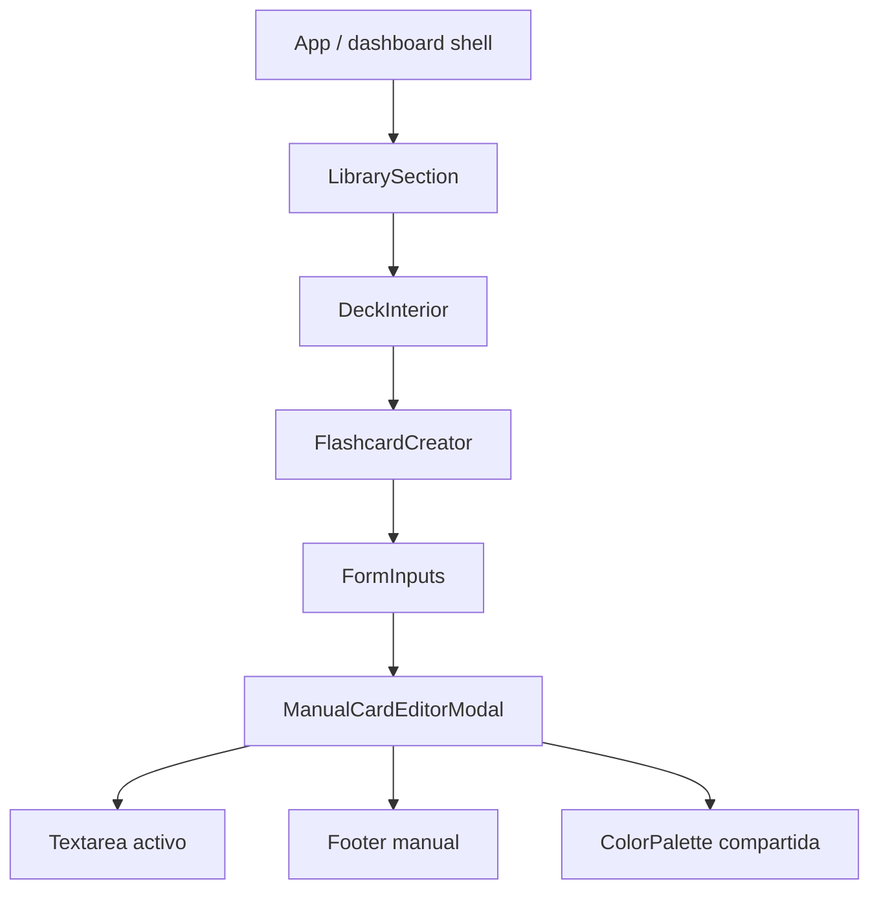
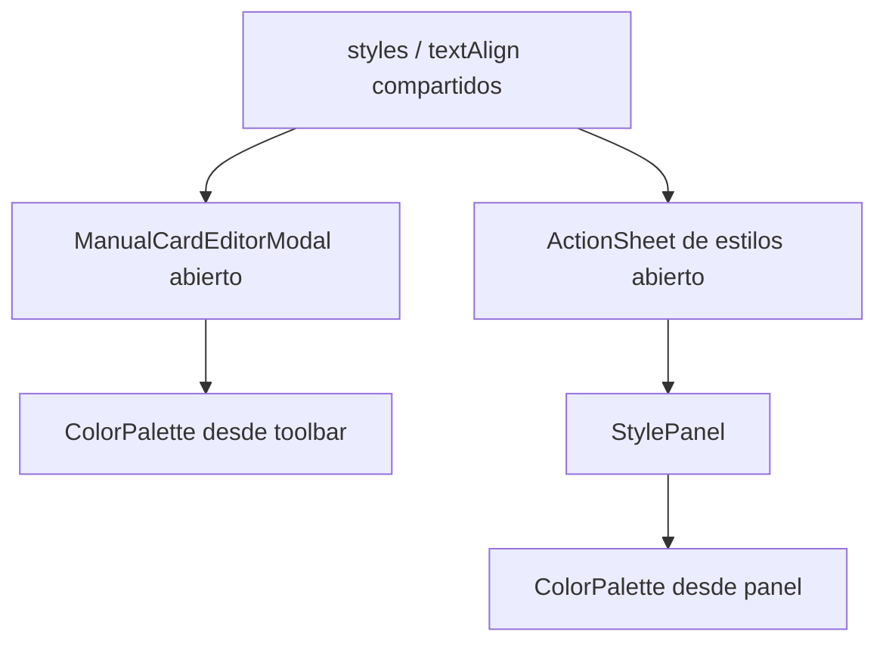
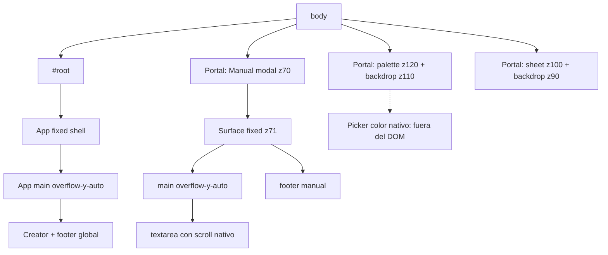
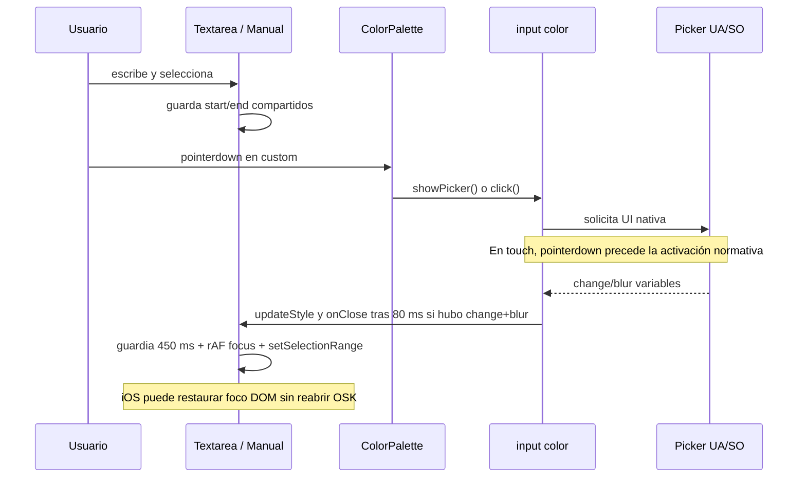
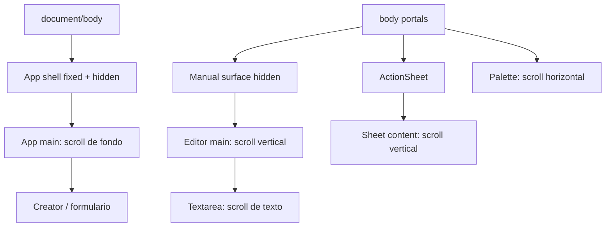
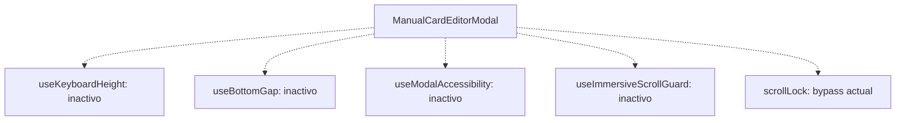
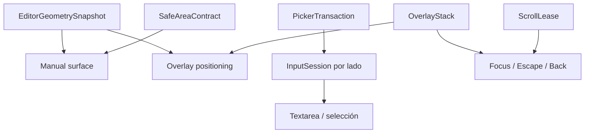

# Mapa de dependencias del editor manual

**Commit auditado:** `bc541f930f7fc6e3eb055adb0cb4a232d5099b5c`.  
**Naturaleza:** mapa estático de imports, estado, DOM, portales, foco, scroll y runtime. No describe una V2 implementada.

## 1. Ruta de render activa

La apertura real parte del botón de pregunta/respuesta en `FormInputs`. `manualEditorSide` decide montaje, lado inicial y cierre; `onModalStateChange` informa a `FlashcardCreator` para ocultar superficies de fondo. Al editar una tarjeta existente, el efecto de `FormInputs` abre automáticamente el lado pregunta.

## 2. Estado y dependencias funcionales

| Propietario | Estado/servicio | Consumidores | Observación |
|---|---|---|---|
| `DeckInterior` | `question`, `answer`, `styles`, `textAlign`, imagen, `showStyles` | `FlashcardCreator`, editor, previews | Es la fuente de contenido/estilo persistible. |
| `FlashcardCreator` | `isManualModalOpen` | footer global, preview, sheet de estilos, medidor de footer | Es visibilidad del flujo, no modalidad DOM. |
| `FormInputs` | `manualEditorSide` | montaje y `initialSide` del modal | `key` remonta el modal al abrir/cambiar desde cerrado. |
| `ManualCardEditorModal` | `activeSide`, `openMenu`, `viewportFrame`, `focusResumeReason` | textarea, toolbar, footer, CTA | Mezcla UI, geometría e inferencia de OSK. |
| `ManualCardEditorModal` refs | selección, foco de retorno, historial de teclado, picker activo, timers | efectos de viewport/menú/picker | Varias transiciones no provocan render. |
| `ColorPalette` | `position`, refs/timer del color input | portal, picker nativo | Reutilizada por modal y `StylePanel`. |
| `ActionSheet` | apertura recibida; foco previo local | StylePanel y otros sheets | Usa `scrollLock`; no es ancestro DOM del portal de paleta. |

## 3. Dos caminos de estilo que comparten código, no DOM

`FlashcardCreator` monta el sheet con `open={showStyles && !isManualModalOpen}`. Por tanto, el `ActionSheet` de estilos y el modal manual no están abiertos simultáneamente por la ruta normal. Sin embargo, ambos invocan la misma `ColorPalette`, y los problemas de esa paleta afectan los dos contextos. No debe describirse `StylePanel` como hijo del modal: el modal solo importa `ColorPalette` y `ColorSwatchButton` del mismo archivo.

## 4. Jerarquía DOM y destinos de portal

### Destino y propiedad actual

| Superficie | Se crea en | Termina en DOM | Posicionamiento | Clipping/stacking relevante |
|---|---|---|---|---|
| Modal manual | `FormInputs` | `document.body` | wrapper `fixed inset-0`; surface `fixed inset-x-0` con `height/top` inline | `isolate` crea stacking context propio; ambos wrappers usan `overflow-hidden`. |
| Textarea | modal | dentro de `main` del modal | normal flow, alto clamp con `20dvh` | Caja exterior `overflow-hidden`; textarea conserva su scroll nativo. |
| Footer manual | modal | dentro de la surface | normal flow, `shrink-0`, no portal | Su safe-area depende de la inferencia `keyboardOpen`. |
| Menú alineación | modal | dentro de la toolbar/footer | popup `absolute`; backdrop `fixed` | El footer `relative z-20` crea su propia capa dentro de la isla z70; los hijos z80/z90 no pueden escapar. El popup puede recortarse por ancestros `overflow-hidden`. |
| ColorPalette | modal o StylePanel | `document.body` | `fixed`, `left/top` medidos | Escapa clipping/transform del propietario, pero también escapa de su ámbito modal/focus trap. |
| Picker custom | input oculto en ColorPalette | UI del navegador/SO | nativo, no CSS | z-index, foco y lifecycle no son controlables por React. |
| ActionSheet | `FlashcardCreator` u otros callers | `document.body` | `fixed bottom-0`, transform de entrada | La transformación anima el sheet; no cambia layout ni dispara `ResizeObserver`. |
| Footer global creator | `FlashcardCreator` | App main | `fixed bottom-0 z30` | Queda debajo del modal z70; su `ResizeObserver` no se instala sin callback. |

### Capas efectivas

| Capa | Elemento | Contexto |
|---:|---|---|
| 30 | footer global de creador | App/root |
| 40 | navegación móvil App | shell |
| 70 | wrapper manual `isolate` | body |
| 71 | surface manual | stacking context manual |
| 80 | backdrop de alineación | stacking context manual |
| 90 | popup alineación / backdrop ActionSheet | el primero dentro de z70; el segundo en body |
| 100 | ActionSheet | body |
| 110 | backdrop ColorPalette | body |
| 120 | ColorPalette | body |

Los números no expresan propiedad. En particular, `z90` de alineación no compite globalmente como `z90` del sheet porque vive dentro de la isla z70; el portal de color sí queda globalmente por encima de ambos.

### Hit-testing y `pointer-events`

No hay reglas CSS `pointer-events:none/auto` en los tres componentes prioritarios. La exclusión de puntero depende de cobertura física y z-index:

- el modal opaco cubre el App shell, pero no lo vuelve `inert` para teclado/AT;
- los backdrops de alineación, paleta y sheet son elementos reales que reciben `pointerdown/click`;
- el backdrop de paleta tiene `tabIndex=-1`, mientras el de `ActionSheet` sigue siendo un botón tabulable fuera del `<section role=dialog>`;
- el CTA de reanudación es `absolute inset-0 z20` sobre el textarea: cuando la heurística lo monta, intercepta todo tap/selección en el campo, incluso con teclado físico.

Por ello, quitar un backdrop o alterar una capa no es solo un cambio visual: modifica el objetivo del gesto y la conservación de foco.

## 5. Flujo exacto de foco: textarea → color custom → retorno

### Puntos exactos donde puede perderse o degradarse foco

1. El trigger de color del modal usa `pointerdown.preventDefault`, por lo que intenta mantener el textarea activo al montar la paleta.
2. El botón custom vuelve a prevenir `pointerdown` y abre el input. Para touch, esa fase no es la activación normativa; `showPicker()` puede rechazar. No existe `onClick` que cubra touch/Enter/Space.
3. El UA puede enfocar el color input o mover foco a UI nativa; React no controla ese tramo. En iOS, el OSK puede cerrarse aunque el textarea siguiera siendo el último objetivo editorial.
4. `change` aplica estilo, pero el cierre depende de un `blur` posterior y 80 ms. Cancelar no tiene transición equivalente.
5. `closeMenu()` borra historia de teclado para cualquier clase de menú, no solo picker custom.
6. `restoreMenuFocus()` espera un rAF, enfoca con `preventScroll` y restaura rango. Ese rAF ya no conserva la activación del gesto; iOS no garantiza OSK y Android puede ignorar `preventScroll`.
7. La paleta escucha Escape en su propio árbol, pero normalmente el foco permanece en el textarea; por tanto el listener global del modal puede recibir Escape antes que el contrato de la paleta.

Conclusión A/B/C/D del selector:

| Clase | Parte del flujo |
|---|---|
| **A — bug nuestro** | Abrir solo en `pointerdown`; no ofrecer `click`/teclado; cerrar por `change → blur → 80 ms`; aplicar guardia de teclado a todos los menús; restaurar desde rAF como si preservara OSK. |
| **B — inevitable del navegador** | UI/foco del picker nativo y posible cierre de OSK en iOS; orden exacto de retorno; imposibilidad de observar un estado universal de teclado. |
| **C — solución parcial** | Preservar valor/rango, transacción de picker, presets DOM, foco DOM cuando sea apropiado y CTA de reanudación desde gesto. |
| **D — no intentar** | Mantener/reabrir OSK garantizado, inferir cierre solo por blur/focus o ajustar el viewport para imitar el picker. |

## 6. Flujo del file picker

| Paso | Evento/estado actual | Carrera |
|---|---|---|
| 1 | Toolbar guarda `selectionStart/end`, marca `imagePickerActive=true`, vacía input y llama `click()` desde `onClick`. | La activación aquí sí es semántica; el UA puede mover foco/OSK. |
| 2a | Si hay archivo, `change` llama al handler, limpia refs y muestra razón `image`. | El handler externo también actualiza contenido/estado padre. |
| 2b | Si se cancela, puede no haber `change`. | No existe transición de cancelación directa portable en el contrato actual. |
| 3 | Cualquier `window.focus` agenda 250 ms y borra solo `imagePickerActiveRef`. | Focus de ventana es indicio, no prueba; no provoca render ni reconcilia CTA. |
| 4 | El usuario toca el CTA y `focusTextarea()` restaura el rango. | Correcto como gesto; `preventScroll` no está garantizado en Android. |

## 7. Scroll containers y propietario esperado

| Nodo | ¿Desplaza hoy? | Propietario recomendado mientras editor está abierto |
|---|---|---|
| `document/body` | No es el scroller principal del shell móvil; sí recibe locks inline | No usar como sustituto del App main; solo alojar portales. |
| App `<main>` | Sí, `overflow-y-auto` | Congelado + `inert`, conservando/restaurando su posición. |
| Modal wrapper/surface | No, ambos `overflow-hidden` | Marco geométrico, nunca scroller. |
| Editor `<main>` | Sí | Scroll vertical primario de contenido/errores. |
| Textarea | Sí, nativo cuando desborda | Scroll del texto/caret; no interceptar. |
| ActionSheet content | Sí | Scroll interno del sheet. |
| ColorPalette horizontal | Sí | Pan horizontal de swatches; no debe invalidar la posición del anchor por sí mismo. |
| Footer manual | No | Siempre dentro del marco, nunca propietario de scroll. |

No hay `scrollIntoView`, `scrollTo`, scroll restoration explícita ni `touchmove.preventDefault` dentro de los tres componentes prioritarios. Aguas arriba, `DeckInterior.handleEdit` sí inicia `window.scrollTo({top:0, behavior:'smooth'})` y el efecto de `FormInputs` autoabre el modal al observar el nuevo `editingId`. Ese movimiento puede continuar detrás del portal y apunta a `window`, no al App `<main>` que desplaza el shell móvil. El problema no se resuelve añadiendo scroll forzado al modal: requiere coordinar la transición con el scroll owner real.

## 8. Dependencias relacionadas pero inactivas en este flujo

| Utilidad/hook | Consumidores encontrados | Relación con editor manual | Decisión de auditoría |
|---|---|---|---|
| `useKeyboardHeight` | otros modales (`DeckModal`, `AcademicFolderModal`, `EvaluationModal`) | Ninguna dependencia runtime actual | No atribuirle síntomas actuales ni importarlo en V2; su arquitectura global es incompatible. |
| `useBottomGap` | `HomeSection` | Ninguna | Fuera de alcance funcional. |
| `useModalAccessibility` | otros diálogos/PDF/calendario | Ninguna | Sus responsabilidades son relevantes, pero conectarlo sin retirar handlers actuales duplicaría foco/Escape. |
| `useImmersiveScrollGuard` | Home/review/session/fast delete | Ninguna en edición de deck | No es el scroll lock del modal. |
| `scrollLock` / `useBodyScrollLock` | `ActionSheet` y otros overlays | El modal lo evita y escribe body directamente | Conservar la idea de propietarios, sustituir el bypass y apuntar al scroller real. |

## 9. Límite de la futura sustitución

El objetivo no es fusionar todo en un hook monolítico. Es que cada hecho tenga un dueño: geometría observable, intención/rango, ciclo de picker, jerarquía de overlays, lease de scroll y propiedad de insets. Ninguno debe exponer `keyboardOpen` como verdad universal.
