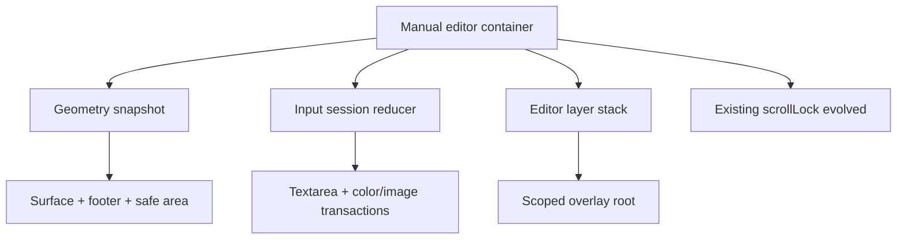

# Arquitectura ejecutable V2 del editor manual

**Estado:** especificación de implementación; todavía no implementada.  
**Commit de diseño:** `ba3027f0d34fa9297f4224235eef263f3d387671`.  
**Auditoría de origen:** [`manual-editor-audit.md`](manual-editor-audit.md).  
**Drift:** [`manual-editor-v2-drift-report.md`](manual-editor-v2-drift-report.md); ningún archivo de producción cambió desde `bc541f9`.

## 1. Decisión ejecutiva

V2 tendrá tres autoridades locales del editor y una primitiva compartida evolucionada:

1. **Geometría observable:** `useEditorGeometry` publica un snapshot completo, agrupado por `requestAnimationFrame`, sin `keyboardOpen`.
2. **Sesión de entrada:** `manualEditorSessionReducer` posee lado, selección, intención, reanudación y la submáquina de pickers; no duplica pregunta ni respuesta.
3. **Pila de capas:** `useEditorLayerStack` posee orden, cierre superior, foco de retorno y adaptación Escape/Back de las capas DOM del editor.
4. **Lease de scroll:** se amplía `scrollLock.js` para bloquear por propietarios el scroller real e inertizar el fondo. No se crea una segunda utilidad.

`SafeAreaContract` se conserva como contrato de CSS y ownership, no como módulo JavaScript. `PickerTransaction` se conserva como subestado del reducer de sesión, no como hook independiente. La arquitectura no crea Context global, no importa `useKeyboardHeight` y no añade dependencias de runtime.



## 2. Contrato de producto

### 2.1 Garantías de V2

- Pregunta, respuesta, imagen y estilos no se pierden por foco, picker, orientación, Escape, Back ni desmontaje.
- Cada lado conserva un rango propio cuando ese rango sigue perteneciendo a la versión actual del valor.
- Toda acción crítica permanece alcanzable. Si el host no expone geometría útil, se permite cerrar el OSK mediante el control del sistema antes de alcanzar el footer.
- Existe una ruta explícita, no bloqueante, para volver a pedir foco desde un gesto.
- Un gesto cierra como máximo una capa DOM.
- Cerrar la última capa libera exactamente una vez listeners, frames, inertness y leases.
- El editor funciona con VisualViewport ausente o no informativo mediante layout seguro y scroll interno.
- Safe area top/left/right/bottom tiene un único propietario dentro de la superficie portaleada.
- Teclado físico, zoom y lector de pantalla no quedan bloqueados por una ayuda táctil.

### 2.2 No garantías

- No existe ni se publica un estado universal `keyboardOpen`.
- `focus()` no se presenta como promesa de OSK.
- `preventScroll` no se presenta como garantía Android.
- No se promete conservar o reabrir el OSK durante un picker nativo.
- No se controla el lifecycle interno del picker ni se deduce cancelación desde `blur`, `focus` o tiempo transcurrido.
- `dvh`, `innerHeight` y VisualViewport no se usan individualmente como detectores absolutos.
- En un WebView cuyo host no entregue ninguna geometría de oclusión, V2 garantiza recuperación y acceso tras ocultar el IME, no una posición imposible de calcular sobre el IME.

### 2.3 Fuera de alcance

- Refactor global de los consumidores actuales de `useKeyboardHeight`.
- Sustitución de `textarea` por `contenteditable`.
- Cambio de `interactive-widget` en `frontend/index.html`.
- Migración general a `<dialog>` o Radix Dialog.
- Rediseño visual completo del editor.
- Backend, persistencia de tarjetas y formato de datos.

## 3. Evaluación de las hipótesis de Fase 2

| Hipótesis | Decisión | Consumidores reales | Forma mínima | Complejidad evitada |
|---|---|---:|---|---|
| `EditorGeometrySnapshot` | Conservar como contrato de datos. | Modal, footer y raíz de popovers; ActionSheet solo después del corte compartido. | Funciones puras + `useEditorGeometry` local. Sin Context. | No hay store global ni detector de teclado. |
| `InputSession` | Conservar. | Un `ManualCardEditorModal`, pero con dos lados, toolbar y dos pickers. | Reducer puro + hook adaptador. | Evita refs paralelas y hace las transiciones testeables. |
| `PickerTransaction` | Fusionar con `InputSession`. | Color e imagen dentro de la misma sesión. | Subestado discriminado por `kind` e `id`. | Evita otro hook, Context y coordinación cruzada. |
| `OverlayStack` | Conservar, pero limitar al editor primero. | Modal raíz, alineación y paleta; ActionSheet adopta el contrato en Corte 4. | Reducer local + un listener Escape/Back. | No convierte todos los popovers en modales ni generaliza antes de probar. |
| `ScrollLease` | Conservar como evolución de `scrollLock.js`. | Editor y ActionSheet; otros callers mantienen adaptador body durante coexistencia. | API por nodo y propietario. | No duplica el owner-set existente. |
| `SafeAreaContract` | Rechazar como módulo JS independiente. | Surface, footer y overlay bounds. | Variables CSS y tabla de ownership consumiendo geometría. | Evita estado duplicado y lecturas JS de `env()`. |

### Context

No se crea Context para geometría, sesión ni scroll. En Corte 3 se permite un **Context scoped de portal**, provisionalmente `OverlayScope`, porque tendrá dos hosts reales —editor y ActionSheet— y múltiples paletas portaleadas. Solo transporta `portalTarget` y la API de capa; no contiene estado global.

## 4. Autoridades y fronteras

| Dominio | Autoridad | Posee | No posee |
|---|---|---|---|
| Contenido | `DeckInterior` / props controladas | pregunta, respuesta, estilos, imagen | foco, selección, geometría |
| Sesión | `manualEditorSessionReducer` | lado, revisiones, rangos, intención, resume hint, picker | valores de tarjeta, OSK, scroll |
| Geometría | `useEditorGeometry` | layout/visual rect, escala, orientación, epoch, fase, oclusión geométrica | teclado, foco, safe-area CSS |
| Capas | `useEditorLayerStack` | orden, top, owner, close reason, return target | picker nativo, geometría, contenido |
| Safe area | surface/footer CSS | propietario por borde y modo conservador | altura del OSK |
| Scroll/inert | `scrollLock.js` evolucionado | owners, nodos, estilos originales, posición | foco o capa superior |
| Picker nativo | agente de usuario | UI y lifecycle interno | estado React; V2 solo observa eventos |

## 5. Snapshot geométrico

### 5.1 Forma

```js
/**
 * @typedef {'unavailable'|'settling'|'stable'} GeometryPhase
 * @typedef {'visual-viewport'|'layout-fallback'} GeometrySource
 *
 * @typedef {Object} EditorGeometrySnapshot
 * @property {number} revision
 * @property {number} epoch
 * @property {GeometryPhase} phase
 * @property {GeometrySource} source
 * @property {'portrait'|'landscape'|'square'} orientation
 * @property {{ left:number, top:number, width:number, height:number }} layout
 * @property {{ left:number, top:number, width:number, height:number, scale:number }} visual
 * @property {{ top:number, right:number, bottom:number, left:number }} occlusion
 */
```

`occlusion` expresa diferencia geométrica entre ambos rectángulos en CSS px. No identifica su causa. `epoch` cambia cuando la clase de orientación o la geometría de layout cambia de forma discontinua; nunca conserva un máximo de una epoch anterior.

### 5.2 Publicación

1. Montaje agenda una lectura.
2. `visualViewport.resize`, `visualViewport.scroll` y `window.resize` solo invalidan; no llaman `setState`.
3. Un scheduler conserva como máximo un rAF pendiente.
4. La primera muestra distinta se publica como `settling`.
5. Una segunda muestra semánticamente igual confirma `stable`.
6. Un evento tardío vuelve a `settling` y crea una nueva revisión.
7. Una muestra idéntica a un snapshot ya estable no publica ni renderiza.
8. Desmontaje cancela el frame y retira los tres listeners.

“Stable” significa estable para el scheduler interno, no “la animación del navegador terminó”. Un evento posterior siempre puede invalidarla.

### 5.3 Fallback

Sin VisualViewport se usa el rectángulo válido más pequeño obtenido de `innerWidth/innerHeight` y `documentElement.clientWidth/clientHeight`. `visual` coincide con `layout`, `source='layout-fallback'` y no se suprime safe area por oclusión. El marco conserva scroll interno y la UI no muestra una altura ficticia de teclado.

## 6. Ownership de safe area

| Borde | Propietario V2 | Regla |
|---|---|---|
| Top | Surface del editor | `env(safe-area-inset-top, 0px)` una vez. |
| Left/right | Surface y bounds de `OverlayScope` | Se aplican una vez al área interactiva; hijos no vuelven a sumarlos. |
| Bottom | Footer del editor | `--editor-safe-bottom-effective`; ningún hijo o backdrop lo suma. |
| ActionSheet | Su propia surface en Corte 4 | Independiente del editor porque no es descendiente visual cuando el editor está cerrado. |
| Body/App | Se conservan para pantallas de fondo | No se consideran heredados por un portal fixed. |

Política inferior:

- `unknown`, `settling`, zoom `scale != 1` o fallback: conservar `env(safe-area-inset-bottom)`.
- Solo una geometría estable, un textarea editorialmente activo y una oclusión inferior observable permiten probar el modo `visual-edge` que suprime el inset por `WK-217754`.
- `visual-edge` es una mitigación acotada, no “teclado abierto”; si las pruebas físicas fallan, el rollback conserva siempre el inset y acepta el hueco seguro.

## 7. EPIC A — Geometría y safe area

**P0 primarios:** `EDITOR-KB-001`, `EDITOR-VV-001`, `EDITOR-SAFE-001`.  
**P1 relacionados:** `EDITOR-VV-002`, `EDITOR-VV-003`, `EDITOR-VV-004`, `EDITOR-SAFE-002`, `EDITOR-AS-002`.

### Invariantes

- No hay propiedad, atributo DOM, evento ni test llamado `keyboardOpen`.
- Un snapshot contiene ambos ejes, escala y fuente.
- Una orientación nueva no compara contra una altura máxima anterior.
- El footer y los popovers consumen el mismo snapshot de la surface.
- Insets laterales existen en landscape.
- El fallback nunca elimina safe area.

### Autoridad, entradas y transiciones

| Elemento | Definición |
|---|---|
| Autoridad | `useEditorGeometry` + CSS ownership de la surface. |
| Entradas | mount/open, VV resize, VV scroll, window resize, unmount. |
| Transiciones | unavailable → settling → stable; stable → settling cuando cambia una muestra; cualquier fase → unavailable al faltar geometría válida. |
| Consumidores | surface, footer, `EditorOverlayRoot` y posicionador de popover. |
| Fallback | layout rect, CSS `100dvh` solo como tamaño de layout, scroll interno y safe area conservadora. |

### Errores recuperables

- Rectángulo cero/NaN: ignorar muestra y conservar la última válida; si no existe, usar fallback.
- Evento tardío: nueva revisión, sin animar desde una medida tratada como definitiva.
- WebView sin resize: mantener layout fallback; el usuario puede ocultar IME mediante el sistema.
- Zoom: seguir rectángulo visual completo y no activar la mitigación inferior.

### Aceptación

- Rotar portrait → landscape → portrait no conserva baseline antiguo.
- Un evento idéntico no renderiza el modal.
- Ningún control produce scroll horizontal en 320 CSS px o landscape con cutout.
- Footer y textarea son recuperables con o sin VisualViewport.
- `VP-02`, `VP-04`, `VP-05`, `VP-07` y el set de pruebas V2 correspondiente quedan PASS; las pruebas físicas permanecen pending hasta ejecutarse.

### Archivos y retiro

- Nuevos: `manual-editor/editorGeometry.js` y `manual-editor/useEditorGeometry.js`.
- Modificados: `ManualCardEditorModal.jsx`; `StylePanel.jsx` para consumir bounds; `ActionSheet.jsx` solo en Corte 4.
- Retirar al completar: `viewportFrame.keyboardOpen`, baseline máximo, umbral 100, listeners directos con `setState`, estilos de ancho basados solo en `100vw`.
- Orden: caracterización → snapshot sin consumidores → surface → footer/insets → popovers → retirar legado.
- Riesgo: alto en iOS/landscape. Rollback: volver el consumidor al frame anterior sin borrar el módulo ni sus tests.

## 8. EPIC B — Sesión de escritura, foco y pickers

**P0 primarios:** `EDITOR-COLOR-001`, `EDITOR-COLOR-002`, `EDITOR-COLOR-004`.  
**Cruce P0:** `EDITOR-FOCUS-003` pertenece primariamente a Epic C, pero limita todo retorno de foco.  
**P1 relacionados:** `EDITOR-FOCUS-001`, `EDITOR-FOCUS-002`, `EDITOR-FOCUS-004`, `EDITOR-FOCUS-005`, `EDITOR-COLOR-003`, `EDITOR-PICKER-001`, `EDITOR-KB-003`.

### Invariantes

- Pregunta y respuesta tienen rangos independientes con dirección, longitud y revisión.
- Foco DOM, selección y OSK son hechos distintos.
- Solo una llamada inmediata intenta foco inicial.
- Preset/alineación nunca inicia ni altera una transacción nativa.
- Color custom e imagen se solicitan desde `click` semántico sin rAF/timeout.
- Toda transacción tiene `id`; eventos viejos se ignoran.
- CTA de reanudación nunca cubre el textarea.

### Autoridad, entradas y transiciones

| Elemento | Definición |
|---|---|
| Autoridad | `manualEditorSessionReducer`. |
| Entradas | open, focusin/out observado, select, change/input, composition, switch side, preset, picker request/input/change/cancel/return signal, resume gesture, close. |
| Transiciones | sesión opening → editing/interrupted → closing; picker idle → requested → external → committed/cancelled/returned-unknown → idle. |
| Consumidores | textarea, switch de lado, toolbar, ColorPalette, file input y CTA. |
| Fallback | presets siempre; `input.click()` dentro del mismo click si `showPicker()` falta o rechaza; CTA/textarea para reanudar. |

### Errores recuperables

- `showPicker()` lanza: ejecutar `click()` inmediatamente en la misma activación.
- Ambos caminos fallan/no muestran UI: mantener la paleta y presets; no perder selección.
- Rango obsoleto: no restaurar ciegamente; colocar caret seguro y capturar una nueva versión.
- Target desconectado: omitir foco y resolver el fallback de `FormInputs`.
- Retorno sin `change/cancel`: estado `returned-unknown`; ninguna acción destructiva automática.

### Aceptación

- Enter/Space, lector de pantalla y tap abren color custom por la ruta semántica.
- Cambiar de lado tres veces conserva cada rango válido y nunca aplica el rango del otro.
- Elegir preset cierra solo la paleta y no crea resume hint por picker.
- Elegir/cancelar color o imagen conserva contenido; iOS puede cerrar OSK y ofrece reanudación.
- Teclado físico puede escribir aunque el resume hint esté visible.

### Archivos y retiro

- Nuevos: `manual-editor/manualEditorSession.js` y `manual-editor/useManualEditorSession.js`.
- Modificados: `ManualCardEditorModal.jsx`, `StylePanel.jsx`, `FormInputs.jsx`.
- Retirar: `selectionRef` único, `keyboardWasOpenRef`, `resumeRequestedRef`, `imagePickerActiveRef`, `focusResumeReasonRef`, `openMenuRef`, `guardKeyboardResumeAfterMenu` y timers 80/250/450.
- Orden: reducer puro → selección por lado → presets → color custom → imagen → CTA → retirar adaptadores.
- Riesgo: alto por OSK/pickers. Rollback: mantener el reducer y volver temporalmente el adaptador de un picker, nunca reintroducir un segundo estado factual.

## 9. EPIC C — Modalidad, overlays y scroll

**P0 primarios:** `EDITOR-FOCUS-003`, `EDITOR-COLOR-005`, `EDITOR-OVERLAY-002`, `EDITOR-AS-001`, `EDITOR-SCROLL-001`.  
**P1 relacionados:** `EDITOR-OVERLAY-001`, `EDITOR-AS-002`, `EDITOR-SCROLL-002`, `EDITOR-SCROLL-003`, `EDITOR-COLOR-006`.

### Invariantes

- El editor raíz está fuera de `#root` cuando `#root` queda inert.
- Todos los overlays DOM del editor terminan en un root scoped dentro del diálogo.
- Color y alineación son popovers no modales; no reciben `aria-modal`.
- Solo el top responde a Escape, Back o backdrop.
- Un picker nativo no se introduce en la pila DOM.
- App `main` se congela; editor main, textarea, sheet content y paleta conservan su scroll.
- La última release restaura exactamente los estilos/atributos originales.

### Autoridad, entradas y transiciones

| Elemento | Definición |
|---|---|
| Autoridad | `useEditorLayerStack` para capas; `scrollLock.js` evolucionado para scroll/inert. |
| Entradas | root open/close, toggle popover, backdrop click, Escape, popstate/Back entregado a la página, owner acquire/release, unmount. |
| Transiciones | root → root+popover → root; root → closed. Una acción procesa solo el top. |
| Consumidores | modal, ColorPalette, alineación, ActionSheet en Corte 4, App shell y `DeckInterior`. |
| Fallback | sin history adapter, Escape/backdrop/controles siguen operables; si host intercepta Back, no se falsifica recepción. |

### Errores recuperables

- Root de portal no disponible en primer commit: no montar el popover hasta registrar target; el trigger conserva estado.
- Return target desconectado: usar resolver de `FormInputs`; si tampoco existe, no enfocar `body`.
- Scroll root no encontrado: lease conservador de body/document, con warning solo en desarrollo.
- Back interceptado por WebView host: el documento no puede garantizar evento; prueba dentro del host y contrato nativo requerido.

### Aceptación

- Mismo botón abre/cierra sin reapertura por el gesto.
- Escape/Back/backdrop cierran paleta, luego cualquier sheet superior y finalmente modal, una capa por evento.
- Tab/Shift+Tab no llegan a `#root` inert.
- Arrastrar fondo no mueve App; main del editor, textarea y paleta sí desplazan.
- Cerrar por cualquier ruta deja cero owners, cero inert huérfano y foco lógico.

### Archivos y retiro

- Nuevos/graduados: `common/overlays/layerStack.js`, `common/overlays/overlayRegistry.js`, `manual-editor/useEditorLayerStack.js`, `manual-editor/EditorOverlayRoot.jsx` y `common/OverlayScope.jsx` scoped.
- Modificados: `ManualCardEditorModal.jsx`, `StylePanel.jsx`, `FormInputs.jsx`, `App.jsx`, `DeckInterior.jsx` y `scrollLock.js`.
- Corte 4 modifica `ActionSheet.jsx` y `FlashcardCreator.jsx`; Corte 5 elimina el re-export temporal del reducer local y deja `common/overlays` como autoridad única.
- Retirar: z-index globales 80/90/110/120 del editor, listener Escape por componente, lock inline del modal, backdrop enfocable del sheet y `preserveFocus`.
- Riesgo: muy alto en componente compartido. Rollback separado: editor local no depende de migrar todos los ActionSheet.

## 10. EPIC D — Estado y lifecycle

**P0 primario:** `EDITOR-STATE-001`.  
**P1 relacionados:** `EDITOR-KB-002`, `EDITOR-COLOR-003`, `EDITOR-PICKER-001`, `EDITOR-FOCUS-001`, `EDITOR-HOOK-001` como prohibición de dependencia.

### Invariantes

- Estado de transición vive en reducers, no en refs que esperan otro render.
- Refs se limitan a nodos DOM, callbacks actuales, transaction IDs y handles cancelables.
- No hay timers de 80, 250 o 450 ms usados como evidencia.
- Cada effect registra y limpia exactamente sus recursos; setup/cleanup repetido es idempotente.
- Un evento con transaction ID viejo no cambia la sesión actual.

### Autoridad y consumidores

Epic D no crea `useManualEditorRuntime` ni un hook monolítico. La sesión posee transiciones de input/picker; geometría posee rAF/listeners; capas poseen Escape/Back; scroll posee leases. `ManualCardEditorModal` solo compone sus APIs.

| Elemento | Definición |
|---|---|
| Autoridad | Los tres reducers especializados y el registry de leases; nunca una ref espejo del runtime completo. |
| Entradas | Eventos tipados de sesión/geometría/capas, mount, close, unmount y callbacks tardíos con ID. |
| Transiciones | Cada dominio reduce atómicamente; `CLOSE/RESET/release` invalida trabajo tardío y converge a cero recursos. |
| Consumidores | `ManualCardEditorModal`, sus hooks adaptadores, `StylePanel`, integración de imagen en `FlashcardCreator` y tests puros. |
| Fallback | Un evento desconocido/stale es no-op; una capacidad ausente selecciona el fallback del dominio sin crear un estado global alternativo. |

### Errores recuperables

- Callback de picker después de desmontaje: ID invalidado y no-op.
- Setup/cleanup repetido por StrictMode: registro y release idempotentes.
- Excepción DOM local de foco/selección: se registra resultado y continúa la sesión; no crea un retry temporizado.
- rAF cancelado o ejecutado en carrera con cierre: el token de instancia impide publicación posterior.
- Falta de un evento concluyente del UA: estado `unknown` operable, no timer de resolución.

### Aceptación

- Tests de reducer cubren todas las transiciones y eventos repetidos.
- StrictMode de desarrollo no duplica listeners, owners ni restauraciones.
- Desmontar durante settling, picker unknown o layer abierta termina sin callbacks tardíos.
- `useKeyboardHeight` no aparece en el grafo ni en imports V2.

### Retiro y rollback

- Retirar refs espejo, segundo detector, timers y `autoFocus` cuando el adaptador V2 cubra la ruta.
- Conservar temporalmente solo adaptadores con fecha/corte de eliminación explícito.
- Rollback por corte, no mediante un store paralelo permanente.

**Archivos:** los módulos puros/hooks nuevos de sesión, geometría y capas; cambios en `ManualCardEditorModal.jsx`, `StylePanel.jsx` y `FlashcardCreator.jsx`; tests del lifecycle.  
**Orden:** tests/reducers de Corte 0 → sesión Corte 1 → geometría Corte 2 → capas/cleanup Corte 3 → retirada Corte 5.  
**Riesgo:** alto por carreras de desmontaje. El rollback devuelve únicamente el adaptador del corte fallido; nunca mantiene dos reducers escribiendo la misma transición.

## 11. Módulos y APIs propuestas

Los nombres son provisionales de archivo, pero las responsabilidades y límites son decisiones de esta especificación.

### 11.1 `editorGeometry.js`

**Responsabilidad única:** leer, normalizar, comparar y reducir geometría observable.

**Estado propio:** snapshot, epoch, revisión, fase y última muestra candidata.  
**No posee:** foco, selección, safe area, layers, keyboard/IME.

```js
export function readEditorGeometry(windowLike, documentLike) {}
export function geometrySamplesEqual(a, b) {}
export function reduceEditorGeometry(state, event) {}

// Eventos puros:
// OPEN, SAMPLE, CONFIRM, SOURCE_UNAVAILABLE, CLOSE
```

**React:** ninguna dependencia.  
**Consumidores:** `useEditorGeometry` y tests.  
**Pruebas aisladas:** fallback, NaN/0, igualdad, epoch de orientación, scale, oclusión por borde y confirmación estable.  
**Sustituye:** fórmula de `viewportFrame`, máximo histórico y comparación de 100 px.

### 11.2 `useEditorGeometry.js`

**Responsabilidad única:** suscribir invalidaciones, ejecutar un único scheduler rAF y publicar el reducer.

```js
export function useEditorGeometry({
  active,
  onDiagnosticEvent, // solo dev/test; nunca contenido
}) {
  return /** @type {EditorGeometrySnapshot} */ ({});
}
```

**Eventos recibidos:** mount/unmount, VV resize/scroll y window resize.  
**Datos publicados:** un snapshot inmutable.  
**Lifecycle:** setup cuando `active=true`; cleanup idempotente; cancela rAF.  
**Fallback:** llama `readEditorGeometry` sin VV.  
**Consumidores exactos:** `ManualCardEditorModal` y `EditorOverlayRoot` por prop; ActionSheet adopta el sampler puro en Corte 4.  
**No Context:** dos consumidores están dentro del mismo árbol React.

### 11.3 `manualEditorSession.js`

**Responsabilidad única:** reducir la sesión de edición y las transacciones nativas.

```js
/**
 * @typedef {'question'|'answer'} EditorSide
 * @typedef {'none'|'initial-focus-failed'|'picker-returned'|'focus-left-editor'} ResumeReason
 * @typedef {'idle'|'requested'|'external'|'committed'|'cancelled'|'returned-unknown'} PickerStatus
 *
 * @typedef {Object} SideSelection
 * @property {number} start
 * @property {number} end
 * @property {'forward'|'backward'|'none'} direction
 * @property {number} valueLength
 * @property {number} valueRevision
 *
 * @typedef {Object} PickerState
 * @property {number|null} id
 * @property {'color'|'image'|null} kind
 * @property {PickerStatus} status
 * @property {EditorSide|null} side
 * @property {SideSelection|null} selectionAtOpen
 * @property {boolean} changed
 */
export function createManualEditorSession(initialSide) {}
export function manualEditorSessionReducer(state, event) {}
export function clampSelection(selection, valueLength) {}
export function canRestoreSelection(selection, valueMeta) {}
```

**Estado propio:** `activeSide`, metadata/revisión de cada valor, selección por lado, composición, foco observado, razón de resume y picker actual.  
**No posee:** strings de pregunta/respuesta como fuente de verdad, estilos, nodos DOM, geometría ni layers.

**Eventos públicos:**

- `OPEN(side, valueMeta)` y `CLOSE`;
- `VALUE_CHANGED(side, length, revision)`;
- `SELECTION_CAPTURED(side, selection)`;
- `COMPOSITION_STARTED/ENDED`;
- `SIDE_REQUESTED(nextSide)`;
- `FOCUS_ATTEMPTED/FOCUS_OBSERVED/FOCUS_LEFT`;
- `RESUME_OFFERED/RESUME_ACTIVATED/INPUT_OBSERVED`;
- `PICKER_REQUESTED/PICKER_EXTERNAL/PICKER_COMMITTED/PICKER_CANCELLED/PICKER_RETURN_SIGNAL/PICKER_RESOLVED`.

Eventos de picker incluyen `transactionId`; un ID que no coincide devuelve el mismo estado.

**Pruebas aisladas:** matrices completas de transición, idempotencia, rango por lado, revisión obsoleta, composición, preset sin picker y retorno unknown.

### 11.4 `useManualEditorSession.js`

**Responsabilidad única:** conectar reducer, props controladas y operaciones imperativas del textarea.

```js
export function useManualEditorSession({
  open,
  initialSide,
  values,       // { question, answer }; observados, no copiados como autoridad
  textareaRef,
  onValueChange,
}) {
  return {
    state: {},
    captureSelection() {},
    switchSide(nextSide) {},
    attemptFocus(reason, options) {},
    beginPicker(kind) {},
    markPickerExternal(id) {},
    commitPicker(id, payload) {},
    cancelPicker(id) {},
    markPickerReturnUnknown(id) {},
    resolveResumeFromGesture() {},
  };
}
```

`attemptFocus`:

1. valida nodo conectado;
2. llama una vez `focus({preventScroll:true})` y, si la firma lanza, una vez `focus()`;
3. foco y `setSelectionRange` tienen bloques de error separados;
4. restaura rango solo si revisión/longitud siguen válidas;
5. devuelve foco DOM observado, nunca OSK;
6. solo `resolveResumeFromGesture` se presenta como petición con activación explícita.

El hook puede conservar refs de DOM, callback actual, transaction counter y último valor **observado para detectar una transición que sí se despacha**. No puede cambiar estado lógico solo mediante ref.

### 11.5 `common/overlays/layerStack.js`

**Responsabilidad única:** reducir orden y metadata serializable de capas DOM.

```js
/**
 * @typedef {'popover'|'sheet'} EditorLayerKind
 * @typedef {'pointer-preserve'|'move-focus'|'none'} FocusPolicy
 */
export function createEditorLayerState() {}
export function editorLayerReducer(state, event) {}

// OPEN_LAYER, TOGGLE_LAYER, DISMISS_TOP, REMOVE_LAYER, RESET
```

El reducer no almacena callbacks ni nodos. Contiene `id`, `ownerId`, `kind`, `focusPolicy`, orden y token de historia. Un registro en refs del hook asocia callbacks al ID; retirar una entrada retira el registro en la misma operación.

**Pruebas aisladas:** toggle atómico, top-only, dos cierres consecutivos, evento de capa inexistente y reset.

### 11.6 `useEditorLayerStack.js`

**Responsabilidad única:** adaptar reducer a DOM, foco, Escape y Back.

```js
export function useEditorLayerStack({
  active,
  dialogRef,
  overlayRootRef,
  onDismissRoot,
  resolveRootReturnFocus,
}) {
  return {
    topId: null,
    openLayer(config) {},
    toggleLayer(config) {},
    dismissTop(reason) {},
    isTop(id) {},
    getLayerProps(id) {},
  };
}
```

**Un listener:** `keydown` en document mientras el editor está activo; Escape llama `dismissTop('escape')`.  
**Back:** un único sentinel de historia por editor. Si `popstate` llega con una hija abierta, cierra la hija y rearma el sentinel; si solo queda raíz, cierra el editor y no rearma. Los cierres visuales de la raíz consumen el sentinel antes de desmontar. No se añade un `popstate` por componente.  
**Foco:** las capas pointer-preserve pueden mantener textarea; una apertura desde teclado/AT mueve foco a la primera acción. Al cerrar se valida `isConnected` y ownership antes de restaurar.  
**Fallback:** si el host no entrega `popstate`, los demás cierres continúan; la prueba WebView queda pendiente y puede exigir coordinación nativa.

### 11.7 `EditorOverlayRoot.jsx` y `OverlayScope.jsx`

**Responsabilidad:** alojar descendientes portaleados dentro del ámbito del diálogo y ofrecer bounds únicos.

```jsx
<OverlayScope
  portalTarget={overlayRootElement}
  layerStack={layerApi}
>
  {editor}
</OverlayScope>
```

`EditorOverlayRoot` sigue `visual.left/top/width/height`, aplica insets laterales y no tiene scroll propio. Backdrop y popover activan `pointer-events` solo en sus cajas. `ColorPalette` deja de portar siempre a `document.body`: consume el target scoped y cae a body únicamente fuera de un host actualizado durante coexistencia.

**No posee:** estado de capa, geometría ni foco.  
**Pruebas:** portal target, orden DOM accesible, bounds y cleanup del nodo.

### 11.8 `scrollLock.js` evolucionado

No se crea `scrollLease.js`.

```js
export function acquireScrollLease({
  owner,
  scrollRoot,
  inertRoot,
}) {
  return function release() {};
}

export function useScrollLease(config) {}

// Compatibilidad temporal:
export function lockBodyScroll(owner) {}
export function unlockBodyScroll(owner) {}
```

Internamente usa owners por nodo, guarda una sola vez estilos, `scrollTop/scrollLeft` y estado original de `inert`, y hace `release` idempotente. El último owner restaura exactamente. `App.jsx` marca el scroller con `data-app-scroll-root`; el editor resuelve `#root` como inert root y el nodo marcado como scroll root. Si no existe, usa el adaptador body y emite diagnóstico solo en desarrollo.

**No hace:** `touchmove.preventDefault` global, `window.scrollTo` ni restauración indiscriminada del viewport.

### 11.9 Adaptación de `ActionSheet` en Corte 4

El API visual (`open`, `title`, `options`, `footer`, `onClose`) permanece. Cambios de contrato:

- `preserveFocus` ya no forma parte del contrato ni tiene callers;
- backdrop deja de ser botón/tab stop;
- cada sheet registra capa y solo el top maneja Escape/Back/foco;
- `OverlayScope` incluye ColorPalette descendiente;
- `inert` y scroll usan el lease común;
- foco inicial se realiza en layout effect, sin timer 0;
- la surface consume el sampler geométrico probado y conserva scroll interno.

Hay 33 instancias de `ActionSheet` en 15 archivos. Corte 4 es obligatorio para cerrar `EDITOR-AS-001`, pero se integra y revierte separado del editor local.

### 11.10 Matriz de completitud por módulo

Esta tabla completa los contratos anteriores y evita convertir una ausencia de VisualViewport en una responsabilidad artificial de módulos que no leen geometría.

| Módulo | Eventos recibidos / datos publicados | Lifecycle y cleanup | Sin VisualViewport | Integración React y consumidores exactos | Archivos, pruebas y legado sustituido |
|---|---|---|---|---|---|
| `editorGeometry.js` | `OPEN`, `SAMPLE`, `CONFIRM`, `SOURCE_UNAVAILABLE`, `CLOSE`; devuelve snapshot inmutable. | Puro: no registra recursos; `CLOSE` devuelve estado inicial. | Normaliza `inner*`/`client*` a `layout-fallback`. | Sin React; solo lo llaman `useEditorGeometry` y tests. | Nuevo; `UT-GEO-001`–`006`; sustituye fórmula, umbral y baseline máximo del modal. |
| `useEditorGeometry.js` | Invalidaciones VV/window; publica un snapshot por transición semántica. | Se activa con modal, registra tres listeners, coalesce rAF; cleanup cancela frame y listeners. | Se suscribe solo a `window.resize` y publica fallback. | Hook local de `ManualCardEditorModal`; snapshot pasa por props a surface/footer/`EditorOverlayRoot`; ActionSheet adopta sampler en Corte 4. | Nuevo; `PW-GEO-001/002`, `PW-LIFE-001`; sustituye effects/listeners geométricos directos. |
| `manualEditorSession.js` | Eventos de sesión, selección, composición, foco y picker; publica estado serializable. | Puro; `CLOSE` invalida transaction ID y vuelve a estado inicial. | No consume geometría; comportamiento idéntico. | Sin React; solo hook adaptador y tests. | Nuevo; `UT-SES-*`, `UT-PICK-*`; sustituye refs de historia, selección única y timers de certeza. |
| `useManualEditorSession.js` | Recibe props/DOM events; publica estado y comandos imperativos tipados. | Activo mientras modal abierto; al cerrar captura lo válido, invalida callbacks/transaction y no deja timer/listener global. | No depende de VV; resume y selección funcionan igual. | Lo consume `ManualCardEditorModal`; `StylePanel` y `FlashcardCreator` reciben callbacks/estado, no el hook. | Nuevo; `PW-OPEN/SIDE/PICK`; sustituye effects de foco/picker del modal y adaptador de imagen por `window.focus`. |
| `common/overlays/layerStack.js` | `OPEN_LAYER`, `TOGGLE_LAYER`, `DISMISS_TOP`, `REMOVE_LAYER`, `RESET`; publica lista/top serializable. | Puro; `RESET` vacía el estado. | No consume geometría. | Sin React; lo consumen `useEditorLayerStack`, `overlayRegistry` y sus tests. | Graduado en Corte 4 y único en Corte 5; `UT-LAY-001`–`004`; sustituye booleans/listeners de menú como autoridad. |
| `useEditorLayerStack.js` | Eventos DOM Escape/backdrop/popstate y comandos de UI; publica API/top/props. | Un keydown, un popstate y un sentinel máximo; cleanup retira listeners/registry, consume sentinel y valida return target. | El orden/cierre no cambia; placement recibe bounds fallback de GEO. | Lo consume el modal; API via `OverlayScope` llega a ColorPalette/alineación/ActionSheet migrado. | Nuevo; `UT-LAY-005/006`, `PW-ESC/BACK/LIFE`; sustituye Escape, retorno y z-index dispersos. |
| `EditorOverlayRoot.jsx` / `OverlayScope.jsx` | Reciben target, layer API y bounds; publican target/API scoped por Context. | Root existe solo con el diálogo; desmontaje retira nodo y no restaura foco por sí mismo. | Usa bounds `layout-fallback` y CSS conservador. | Componentes React: modal host; consumidores `StylePanel`/`ColorPalette`, alineación y ActionSheet del editor. | Nuevos; portal/bounds en `PW-MENU/A11Y/VIS`; sustituyen portales directos huérfanos, no el concepto de portal. |
| `scrollLock.js` evolucionado | `acquire/release` por owner/nodo; publica solo diagnósticos/count en test/dev. | Primera adquisición guarda; cada release idempotente; la última restaura estilos, scroll e inert originales. | Independiente de VV. | Utilidad compartida + `useScrollLease`; editor y ActionSheet V2 usan leases; callers antiguos usan API compatible. | Modificado; `UT-SCR-*`, `PW-SCROLL`; sustituye lock inline, no elimina el owner-set existente. |
| `ActionSheet.jsx` adaptado | Recibe API pública actual y scope opcional; registra/retira una layer; publica UI/close callback una vez. | Al abrir adquiere layer/lease; cleanup los libera y valida foco; sin timer 0. | Bounds layout + scroll interno; no usa `dvh` como OSK. | Componente compartido: 33 instancias/15 archivos; no conserva `preserveFocus`. | Modificado en Corte 4; `UT-AS-*`, `PW-AS-*`, `DEV-AS-001`; sustituye trap/portal/body lock privados. |

Todos los módulos declaran explícitamente lo que **no** poseen en sus contratos o en la tabla de autoridades de §4. Ninguno recibe contenido textual en diagnósticos y ninguno crea un Context global.

## 12. Contratos visibles de UI

1. **Apertura sin OSK:** si el textarea no obtiene foco, aparece un botón compacto “Continuar escribiendo” fuera de su caja. Si obtiene foco pero el OSK no aparece, el propio textarea sigue siendo una acción táctil. Nunca hay overlay `absolute inset-0`.
2. **Teclado físico:** el resume hint no intercepta selección, caret ni teclas y desaparece tras `beforeinput/input` o gesto de reanudación.
3. **Preset:** aplica una vez, cierra una capa y no despacha eventos de picker.
4. **Color custom iOS:** se acepta cierre de OSK; contenido/rango permanecen y al volver se ofrece reanudación. No hay mensaje que prometa “mantener teclado”.
5. **Toggle:** `pointerdown` puede preservar foco solo para menú DOM; `click` ejecuta una única transición `TOGGLE_LAYER`. Pulsar el mismo trigger cierra y no reabre.
6. **Footer:** permanece dentro del frame flex. En fallback no se fija contra una altura inventada; el sistema puede exigir ocultar IME para acceder, sin pérdida de datos.
7. **Landscape:** top, left, right y bottom respetan `env(safe-area-inset-*, 0px)` según ownership.
8. **Scroll:** App main queda congelado; editor main, textarea, contenido de ActionSheet y paleta horizontal conservan scroll.
9. **Escape/Back:** primero popover, después sheet superior si existe, después modal y solo luego navegación real. Si el host intercepta Back, se registra como limitación del host.
10. **Picker desconocido:** no cierra ni guarda por `window.focus`. La página vuelve a un estado utilizable con salida manual.

## 13. Flujo semántico de controles

| Control | `pointerdown` | `click` | Foco |
|---|---|---|---|
| Preset/alineación | Puede `preventDefault` para preservar textarea; no cambia estado. | Aplica + dismiss top. | Pointer conserva; teclado/AT usa foco visible. |
| Trigger de menú DOM | Puede preservar foco; no abre/cierra. | `TOGGLE_LAYER`. | Según modalidad observada de activación. |
| Color custom | Captura rango, **sin** impedir el foco por contrato. | En el mismo call stack: begin transaction → `showPicker` o `click`. | UA puede moverlo/cerrar OSK. |
| Imagen | Captura rango, no afirma conservar OSK. | Resetea input y ejecuta `click()`. | UA controla transición. |
| Backdrop | Previene acción del fondo. | `DISMISS_TOP`. | No es tabbable ni recibe retorno. |
| Resume | Sin lógica. | Un intento de foco + rango válido desde gesto. | Resultado DOM observado; OSK desconocido. |

## 14. Archivos previstos

### Nuevos durante implementación

- `frontend/src/components/creator/manual-editor/editorGeometry.js`
- `frontend/src/components/creator/manual-editor/useEditorGeometry.js`
- `frontend/src/components/creator/manual-editor/manualEditorSession.js`
- `frontend/src/components/creator/manual-editor/useManualEditorSession.js`
- `frontend/src/components/common/overlays/layerStack.js`
- `frontend/src/components/common/overlays/overlayRegistry.js`
- `frontend/src/components/creator/manual-editor/useEditorLayerStack.js`
- `frontend/src/components/creator/manual-editor/EditorOverlayRoot.jsx`
- `frontend/src/components/common/OverlayScope.jsx`
- tests pares `*.test.js` y Playwright definidos en el plan de pruebas

### Modificados

- `ManualCardEditorModal.jsx`, `StylePanel.jsx`, `FormInputs.jsx`
- `FlashcardCreator.jsx`, `DeckInterior.jsx`, `App.jsx`
- `scrollLock.js`
- `ActionSheet.jsx` únicamente en Corte 4
- `frontend/package.json` y configuración Playwright únicamente como dependencia de desarrollo en Corte 0

### No modificados por diseño

- `frontend/index.html`: conserva viewport-fit y zoom.
- `frontend/src/hooks/useKeyboardHeight.js`: sigue fuera; sus consumidores requieren proyecto separado.
- `frontend/src/hooks/useModalAccessibility.js`: no se conecta al editor.
- `backend/src/**`: sin cambios.

## 15. Dependencias

No se añade dependencia de runtime. Reducers usan JavaScript puro y `node:test`. Para las pruebas de navegador se justifica `@playwright/test` como **devDependency** en Corte 0 porque el repositorio no contiene runner de navegador y la emulación solicitada no puede ejecutarse con `node:test`. Si no se aprueba esa devDependency, las pruebas B quedan bloqueadas; no se sustituirán por mocks declarados equivalentes.

## 16. Decisiones que requieren dispositivo físico

- Momento y conveniencia de activar `visual-edge` para `WK-217754`.
- Resultado real de foco inicial y reanudación en Safari iOS.
- Lifecycle de color/file picker y retorno unknown por navegador.
- Back entregado por Samsung Internet y por cada host WebView.
- Scroll lock iOS con OSK + zoom y TalkBack/VoiceOver.
- Geometría de WebView <M139, IME alternativo y cutouts reales.

Hasta ejecutarlas, su estado es `PENDING — DEVICE REQUIRED`. La arquitectura define fallback y rollback; no declara compatibilidad física como PASS.

## 17. Regla de terminación de V2

V2 no está completa mientras:

- algún P0 esté fuera de la matriz de trazabilidad;
- el viejo `keyboardOpen` o cualquiera de los tres timers siga decidiendo UX;
- `ActionSheet` no haya pasado su corte compartido o `EDITOR-AS-001` no tenga una decisión de release explícita;
- falten pruebas físicas P0;
- exista un lease, inert o history sentinel huérfano al desmontar.
