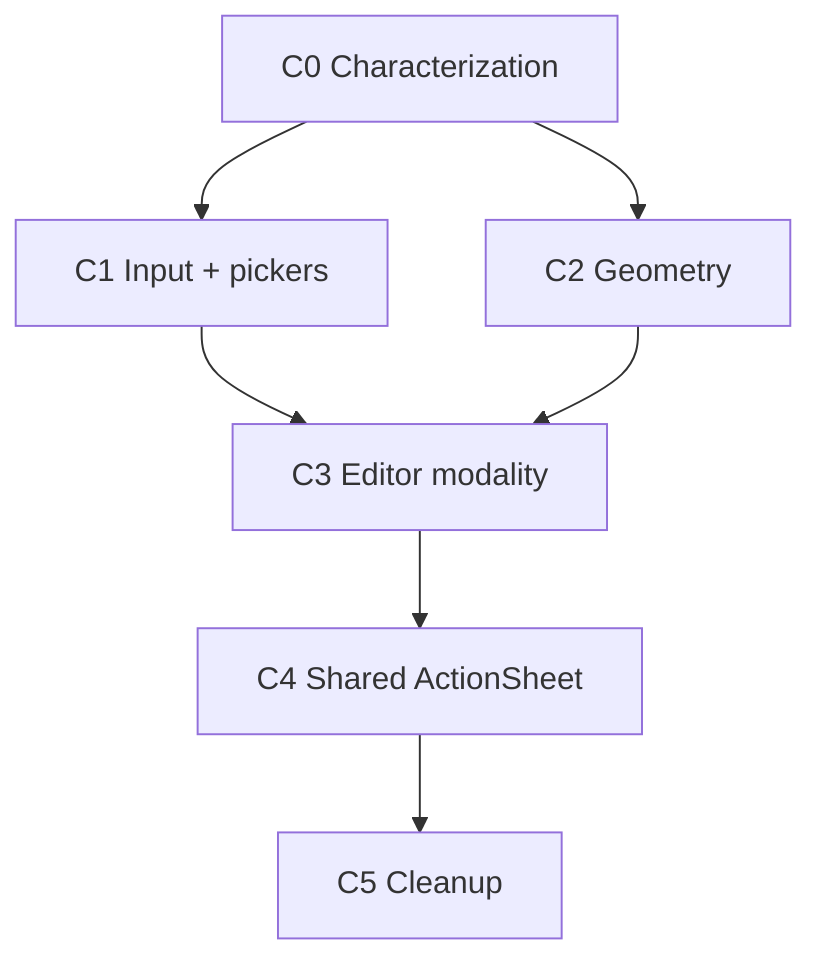

# Plan de migración V2 del editor manual

**Base:** [`manual-editor-v2-architecture.md`](manual-editor-v2-architecture.md).  
**Estado:** plan ejecutable; no se ha modificado producción.  
**Estrategia:** seis cortes, numerados 0–5, pequeños, ordenados y reversibles. Ningún corte reescribe el editor completo.

## 1. Reglas de migración

- Cada corte debe compilar, pasar sus pruebas deterministas y conservar las garantías `KEEP`.
- El sistema viejo y el nuevo solo pueden coexistir mediante un adaptador documentado; nunca ambos escriben la misma decisión.
- Un módulo nuevo puede ejecutarse en modo sombra para diagnóstico, pero no publicar dos estados React.
- No se elimina código antiguo hasta que no queden imports, callers ni tests que dependan de él.
- Los cambios de `ActionSheet` tienen rollback separado.
- Ningún resultado de emulación convierte una prueba física en PASS.
- No se añade `useKeyboardHeight`, sniffing de UA, `interactive-widget`, blur geométrico ni touch guard global.

## 2. Resumen de cortes

| Corte | Resultado | Epics | Riesgo |
|---:|---|---|---|
| 0 | Caracterización, harness, IDs de pruebas y diagnóstico dev. | Todos | Bajo |
| 1 | Sesión por lado y transacciones color/imagen. | B + D | Alto |
| 2 | Snapshot geométrico y safe area únicos. | A + D | Alto |
| 3 | Modalidad, popovers, Back/Escape y lease de scroll del editor. | C + D | Muy alto |
| 4 | Graduación del contrato a `ActionSheet` compartido. | C + A | Muy alto / compartido |
| 5 | Retirada confirmada de legado y cierre documental. | Todos | Medio |

## 3. Corte 0 — Caracterización e instrumentación

### Objetivo

Congelar comportamiento útil, reproducir fallos deterministas y crear una ruta de pruebas sin backend ni autenticación. No cambia UX.

### Archivos

**Nuevos previstos:**

- `frontend/playwright.config.js`
- `frontend/tests/manual-editor/harness.html`
- `frontend/tests/manual-editor/harness.jsx`
- `frontend/tests/manual-editor/manual-editor-current.spec.js`
- `frontend/tests/manual-editor/evidence-schema.json`
- `frontend/src/components/creator/manual-editor/manualEditorDiagnostics.js`

**Modificados previstos:**

- `frontend/package.json`: scripts y `@playwright/test` como devDependency.
- `ManualCardEditorModal.jsx` y `StylePanel.jsx`: únicamente callback de diagnóstico guardado por `import.meta.env.DEV`; no contenido de tarjeta.

### Harness

El harness monta `ManualCardEditorModal` con estado local y fixtures:

- tarjeta vacía y tarjeta con 30 líneas;
- pregunta/respuesta distintas;
- imagen mock;
- geometría real del navegador o adapter inyectable;
- contadores de renders, listeners, picker events y layers;
- un App main simulado con `data-app-scroll-root`.

No es entry de `vite build` y no se sirve en producción.

### Caracterización

- PASS obligatorio para `KEEP-001/002/003/005/006/007/009/011/012/013`.
- Reproducciones `test.fixme` o casos rojos documentados para los P0; no se “aprueba” el bug.
- Snapshot de `window.visualViewport` nunca contiene texto.

### Dependencias

- Ningún corte previo.
- Se justifica `@playwright/test` solo para tests; no hay dependencia runtime.

### Pruebas previas

- `npm run build`.
- Tests frontend `node --test` existentes.
- `git diff` confirma que producción coincide con `ba3027f` antes del corte.

### Pruebas posteriores

- Harness abre en Chromium/WebKit de Playwright.
- `PW-CHAR-001` captura apertura actual.
- `PW-CHAR-002` reproduce toggle/preset.
- `PW-CHAR-003` demuestra orden de Escape actual sin declarar compatibilidad móvil.
- Diagnóstico se elimina de bundle de producción o queda inerte.

### Coexistencia

No existe runtime V2. Solo contratos/test IDs.

### Rollback

Eliminar harness, scripts y diagnóstico. Criterio: build o tests existentes cambian pese a no haber cambio UX.

### Salida exacta

Corte 0 termina cuando el harness ejecuta local/CI, los `KEEP` tienen asserts y cada P0 tiene un test o una razón física trazada.

## 4. Corte 1 — Sesión de input y pickers

### Objetivo

Introducir `manualEditorSessionReducer`, selección por lado y transacciones color/imagen. Separar presets de UI nativa.

### Archivos

**Nuevos:**

- `manual-editor/manualEditorSession.js`
- `manual-editor/useManualEditorSession.js`
- `manual-editor/manualEditorSession.test.js`

**Modificados:**

- `ManualCardEditorModal.jsx`
- `StylePanel.jsx`
- `FormInputs.jsx`
- harness/specs

### Orden interno

1. Añadir reducer puro y tests sin conectarlo.
2. Conectar selección question/answer y revisión.
3. Separar foco de `setSelectionRange`.
4. Hacer que preset/alineación solo actualicen estilo + close.
5. Mover custom color de `onPointerDown` a `onClick`.
6. Conectar feature detection/fallback y transaction ID.
7. Migrar file input a commit/cancel/unknown sin timer.
8. Sustituir overlay de CTA por acción compacta no bloqueante.

### Pruebas previas

- Corte 0 completo.
- `CP-01/02/03` e `IN-04` registrados como baseline físico PENDING, no PASS.

### Pruebas posteriores

- `UT-SES-001..006`.
- `UT-PICK-001..004`.
- `PW-SIDE-001`, `PW-MENU-001`, `PW-PICK-001` y `PW-PICK-002`.
- Build y tests existentes.

### Coexistencia temporal

- `useManualEditorSession` posee selección y picker.
- La geometría heredada todavía posiciona surface/footer.
- El detector inicial heredado puede seguir proporcionando **solo un hint visual de compatibilidad** hasta Corte 2; no puede escribir el reducer ni decidir picker.
- `keyboardWasOpenRef` y el detector 450 ms se marcan `@remove-in-cut-2`.

### Código retirado en este corte

- `selectionRef` único.
- Custom picker en `onPointerDown`.
- `customColorChangedRef → blur → 80 ms` como cierre obligatorio.
- `pickerReturnTimerRef` de 250 ms como certeza.
- `guardKeyboardResumeAfterMenu` y su timer de 450 ms.
- Refs de picker/menú sustituidas por reducer, cuando ya no tengan consumidores.

### Rollback

Revertir adaptador por picker de forma independiente. El reducer y tests pueden permanecer sin consumidor. Nunca restaurar el custom picker en timer/rAF.

### Criterio de rollback

- Ruta click/Enter/Space no abre picker en harness.
- Un preset crea estado picker.
- Cambio de lado aplica rango incorrecto.
- Contenido se pierde en cancel/unknown.

### Salida exacta

Pregunta y respuesta tienen selección propia; timers 80/250 y guardia general 450 ya no deciden el flujo. Tras evidencia física posterior al Corte 5, los controles sensibles al foco usan una activación única: puntero en `pointerdown` primario y teclado/AT en click semántico, suprimiendo el click de compatibilidad.

## 5. Corte 2 — Geometría y safe area

### Objetivo

Sustituir `viewportFrame`/`keyboardOpen` por snapshot completo y aplicar ownership top/left/right/bottom.

### Archivos

**Nuevos:**

- `manual-editor/editorGeometry.js`
- `manual-editor/useEditorGeometry.js`
- `manual-editor/editorGeometry.test.js`

**Modificados:**

- `ManualCardEditorModal.jsx`
- `StylePanel.jsx`
- `EditorOverlayRoot.jsx` si se adelanta su shell sin stack
- harness/specs

### Orden interno

1. Sampler puro y equality tests.
2. Hook en modo sombra: compara métricas, no renderiza UI doble.
3. Surface consume `left/top/width/height`.
4. Footer consume safe-area policy conservadora.
5. Insets laterales se aplican al área interactiva.
6. Posicionador de paleta consume bounds reales y escribe tamaño + posición.
7. Eliminar snapshot heredado y detector inicial.

### Pruebas previas

- Corte 1 completo.
- Reducer de sesión no depende de `keyboardOpen`.
- Evidencia baseline de rotation/zoom disponible.

### Pruebas posteriores

- `UT-GEO-001..006`.
- `PW-GEO-001`, `PW-OPEN-001`, `PW-VIS-001`.
- Cero render ante snapshot estable idéntico.
- Sin horizontal overflow en 320×568, 568×320 y zoom simulado.

### Coexistencia temporal

Durante el primer commit, el snapshot nuevo corre en sombra y registra diferencias solo en dev. En cuanto surface cambia de consumidor:

- viejo `viewportFrame` queda read-only;
- ningún footer/paleta puede mezclar ambos;
- se elimina en el mismo corte después del test A/B del harness.

### Código retirado

- `keyboardOpen` y `data-keyboard-open`.
- baseline monotónico.
- umbral 100.
- segundo detector inicial 450 ms e historia de teclado restante.
- direct `setViewportFrame` por evento.
- width virtual de paleta que no se aplica al DOM.

### Rollback

Revertir consumidores a layout previo, dejando sampler/test. La mitigación `visual-edge` tiene rollback independiente: conservar siempre safe bottom si falla dispositivo.

### Criterio de rollback

- Surface salta/oscilación persistente.
- Rotación deja footer fuera.
- Zoom bloquea controles.
- Safe area lateral reduce de forma incorrecta el portrait.

### Condición exacta para borrar legado

`rg "keyboardOpen|initialLayoutHeight|layoutHeight - 100|initialKeyboardCheckTimerRef" ManualCardEditorModal.jsx` devuelve cero y `UT-GEO/PW-GEO` pasan.

## 6. Corte 3 — Overlays, modalidad y scroll del editor

### Objetivo

Crear root scoped, top layer único, foco modal, Back/Escape y lease del scroller real.

### Archivos

**Nuevos:**

- `manual-editor/editorLayerStack.js`
- `manual-editor/useEditorLayerStack.js`
- `manual-editor/editorLayerStack.test.js`
- `manual-editor/EditorOverlayRoot.jsx`
- `components/common/OverlayScope.jsx`

**Modificados:**

- `ManualCardEditorModal.jsx`
- `StylePanel.jsx`
- `FormInputs.jsx`
- `App.jsx`
- `DeckInterior.jsx`
- `lib/scrollLock.js`
- harness/specs

### Orden interno

1. Reducer de capas puro.
2. Root scoped dentro del diálogo; ColorPalette cae a él.
3. Alineación migra al mismo primitive de popover.
4. Un listener Escape y focus containment.
5. Return target explícito desde `FormInputs`.
6. `App main` recibe `data-app-scroll-root`.
7. `scrollLock.js` añade lease por nodo/inert con API legacy intacta.
8. Modal adquiere/release lease; elimina lock inline.
9. Adaptador de sentinel Back.
10. `DeckInterior.handleEdit` deja de iniciar `window.scrollTo(...smooth)` detrás del modal o estabiliza el scroller real antes de abrir.

### Pruebas previas

- Cortes 1 y 2 completos.
- Tests de snapshot y sesión verdes.
- Auditoría de `history.state` actual confirma que no existe router propietario; si aparece uno, este paso se bloquea hasta integrar su API.

### Pruebas posteriores

- `UT-LAY-001..006`, `UT-SCR-001..003`, `UT-LIFE-001/002`.
- `PW-ESC-001`, `PW-BACK-001`, `PW-SCROLL-001`, `PW-A11Y-001`, `PW-LIFE-001`.
- Physical iOS/Android/AT sigue PENDING hasta ejecución.

### Coexistencia temporal

- `lockBodyScroll/useBodyScrollLock` permanecen para Login, Processing sheets, BottomSheet, calendar e immersive guard.
- Solo el modal manual usa el nuevo node lease.
- ActionSheet conserva comportamiento viejo hasta Corte 4.
- `OverlayScope` permite fallback body para un host no migrado; el editor no usa ese fallback tras pasar el corte.

### Código retirado

- lock inline de `document.body` en modal.
- listeners Escape de modal/paleta.
- alignment absolute y z-index 80/90.
- portal ColorPalette a body sin propietario dentro del editor.
- restauradores rAF dispersos del editor.
- `window.scrollTo({behavior:'smooth'})` de la transición autoopen, si no tiene otro requisito.

### Rollback

Tres commits reversibles: overlay root, lease, history adapter. Un fallo de Back revierte solo sentinel; Escape/backdrop siguen. Un fallo de lease vuelve temporalmente al body adapter sin retirar tests ni inert design.

### Criterio de rollback

- cierre doble;
- Tab llega al shell;
- App main se mueve;
- scroll de textarea/paleta deja de funcionar;
- sentinel consume navegación real.

### Salida exacta

Editor local cumple modalidad y scroll sin depender de `ActionSheet`. Todos sus overlays DOM pertenecen al diálogo y una acción cierra uno.

## 7. Corte 4 — Migración de `ActionSheet` compartido

### Condición de entrada

El contrato local del Corte 3 debe pasar Playwright y la matriz física P0 disponible. Si no, no se generaliza. Este corte sigue siendo obligatorio antes de declarar `EDITOR-AS-001` cubierto para release.

### Alcance real

33 instancias en 15 archivos. Representantes obligatorios:

- opciones simples/destructivas: `DeckCard`, `DeckHeader`;
- contenido custom/footer: `FlashcardCreator`;
- pickers/PDF: `PdfExtractor`;
- sheets consecutivos/anidados: `ScheduleCalendar` y modales de calendario;
- flujo largo: `ExamCreationWizard` / `ExamFoldersView`.

### Archivos

**Nuevos o graduados:**

- mover `manual-editor/editorLayerStack.js` a `components/common/overlays/layerStack.js` solo después del gate;
- `components/common/overlays/overlayRegistry.js` si el registro de callbacks no cabe en `OverlayScope`;
- tests comunes.

**Modificados:**

- `ActionSheet.jsx`
- `OverlayScope.jsx`
- `StylePanel.jsx`
- `FlashcardCreator.jsx`
- imports del editor
- fixtures representativos; callers solo si su contrato cambia

### Cambios

1. Registry top-only compartido.
2. Backdrop no enfocable.
3. Inert/lease común.
4. Scope de portales para ColorPalette.
5. Foco inicial sin timer 0.
6. Geometry sampler probado para frame visible + scroll interno.
7. Eliminar `preserveFocus` y su único caller.
8. Lower sheets quedan inert/disabled cuando existe una superior.

### Pruebas previas

- Corte 3 completo.
- Inventario de 33 instancias congelado.
- Tests de caller contract (options, custom, footer, nested) existentes.

### Pruebas posteriores

- `UT-AS-001/002`.
- `PW-AS-001..004`.
- `PW-ESC-001/PW-BACK-001` repetidos con dos sheets.
- `AS-01..04` físicos pendientes/ejecutados por plataforma.
- Build y toda suite frontend.

### Coexistencia

No puede haber dos registries respondiendo Escape. La graduación mueve el reducer y actualiza editor + sheet en el mismo commit. La API legacy de body scroll permanece para overlays no migrados.

### Rollback

Revertir solo el cambio interno de ActionSheet y `preserveFocus` caller; editor conserva su stack local si el reducer común se devuelve a su ruta anterior.

### Criterio de rollback

- cualquier caller pierde última acción;
- sheet inferior se desbloquea;
- ColorPalette sale del scope;
- foco no vuelve a destino lógico;
- cambio visual sustancial no aprobado.

### Condición exacta de cierre

Las 33 instancias pasan el contract test o están representadas por una clase equivalente documentada; `rg "preserveFocus" frontend/src` devuelve cero; solo top recibe Escape/Back.

## 8. Corte 5 — Eliminación de código heredado

### Objetivo

Eliminar únicamente contratos ya sin consumidores y cerrar la documentación.

### Estado de ejecución

La eliminación estática/determinista del Corte 5 quedó implementada sobre `origin/main` `9a775679b882469ab7c998b5d4233a6087af56cf`. La única implementación del reducer de capas es `components/common/overlays/layerStack.js`; el adaptador local y la medición huérfana del footer ya no forman parte del código. Este estado de código no cierra la certificación móvil: `G5` permanece **`BLOCKED — DEVICE REQUIRED`** hasta disponer de resultados físicos reales.

### Candidatos

- booleano/atributo `keyboardOpen`;
- baseline máximo y umbral 100;
- detectores duplicados;
- timers 80/250/450 como certeza;
- `guardKeyboardResumeAfterMenu`;
- lock inline de modal;
- refs espejo sin transición;
- z-index dispersos del editor;
- `onFooterHeightChange`, `footerRef` y su `ResizeObserver` si una nueva búsqueda confirma cero callers;
- adaptadores body/portal usados solo durante migración, si ningún caller restante depende.

### No eliminar en este alcance

- `useKeyboardHeight.js`: tiene otros consumidores.
- API legacy de `scrollLock.js`: Login, Processing sheets, BottomSheet, calendarios e immersive guard siguen usándola salvo auditoría separada.
- `useModalAccessibility.js`: otros modales lo consumen.
- `-webkit-fill-available` global.
- portales, textarea, fallback `click()`, input color no controlado, scroll interno o safe-area.

### Pruebas previas

- Cortes 1–4 integrados.
- Todos los P0/P1 de trazabilidad cubiertos o diferidos con justificación aceptada.
- Dispositivos P0 ejecutados.

### Pruebas posteriores

- `rg` de símbolos legado.
- Suite determinista/Playwright completa.
- Build.
- Repetición smoke física iOS/Android.
- Auditoría de owners/listeners después de 20 ciclos open/close.

### Rollback

Cada eliminación en commit propio. Si reaparece un caller, recuperar solo ese adaptador con comentario `@remove-when` y test que documente la dependencia.

### Salida exacta

No hay fuente de verdad antigua coexistiendo. Documentación y matrices registran commit implementado, evidencia y resultados físicos reales.

## 9. Matriz de dependencias entre cortes

C1 y C2 pueden desarrollarse en ramas separadas tras C0, pero se integran en ese orden para que la sesión deje de depender de la heurística antes de retirar geometría vieja.

## 10. Gates de release

| Gate | Requisito | Si falla |
|---|---|---|
| G0 | Harness + build sin cambio UX | No iniciar módulos V2. |
| G1 | Sesión/pickers deterministas + browser | Revertir adapter concreto. |
| G2 | Geometry/rotation/overflow automatizado | Mantener layout heredado; no borrar baseline. |
| G3 | Modal/focus/scroll/Back browser + devices disponibles | No generalizar a ActionSheet. |
| G4 | 33 ActionSheet cubiertos por contract classes | Revertir Corte 4; V2 release bloqueada por AS-001. |
| G5 | P0 devices y cleanup audit | No borrar legado ni declarar V2 completa. |

## 11. Evidencia y commit discipline

Cada corte debe entregar:

- commit SHA y diff de archivos;
- pruebas ejecutadas con resultado;
- `test_reports/manual-editor-v2/<sha>/manifest.json`;
- traces/videos sin contenido real;
- lista de pruebas físicas aún `PENDING — DEVICE REQUIRED`;
- condición de rollback evaluada;
- actualización de trazabilidad si cambia alcance.

Este plan no autoriza commit, push ni implementación en Fase 3.
