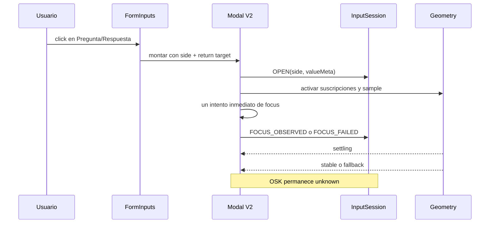
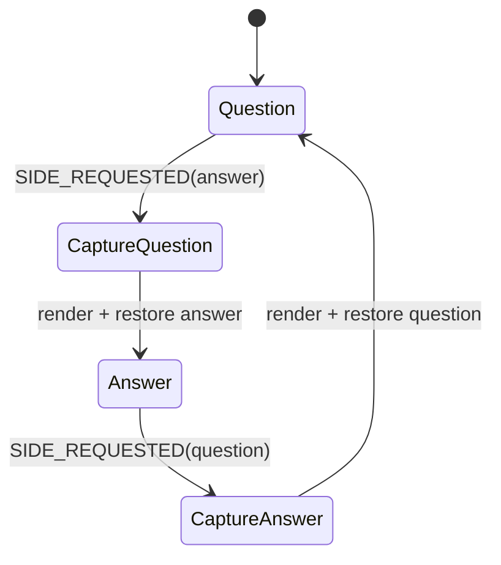
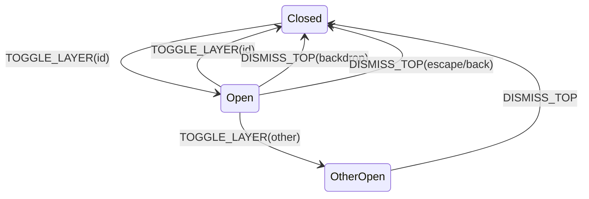
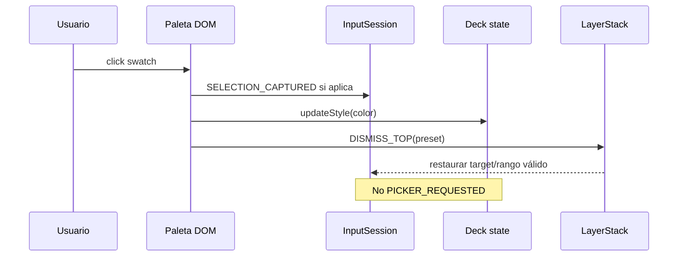
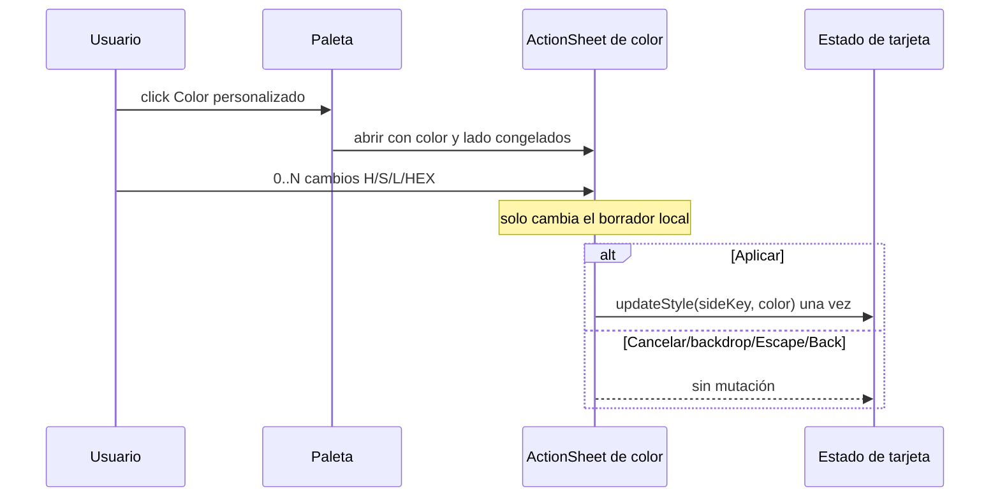
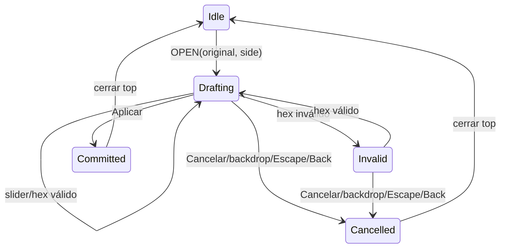
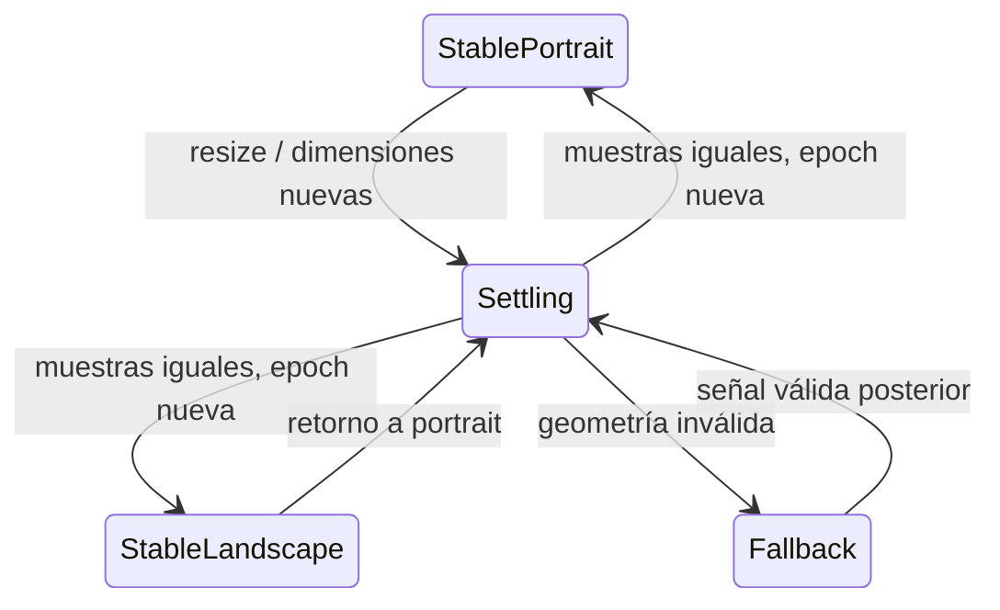
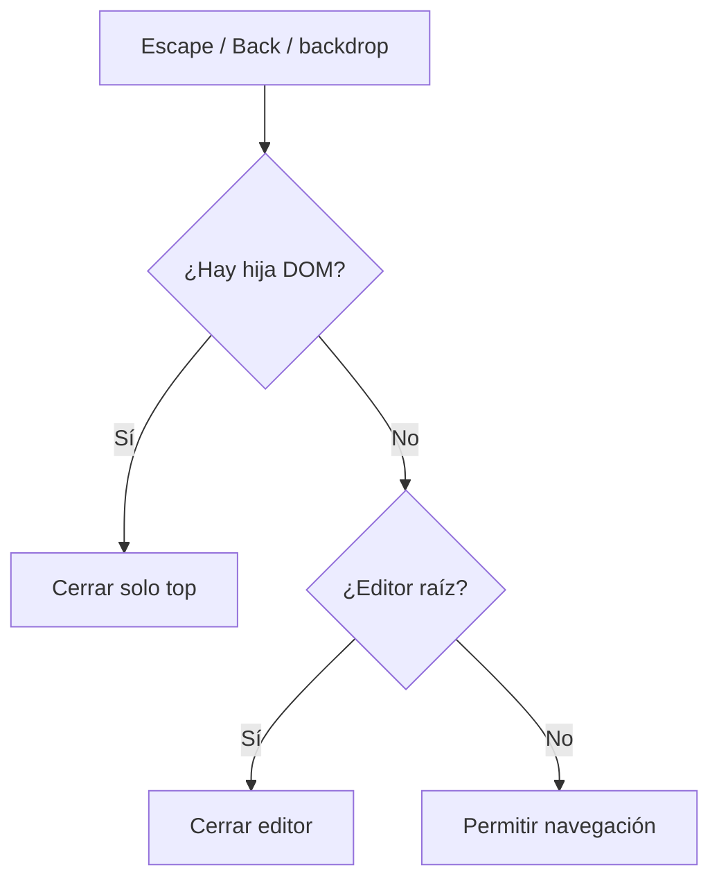
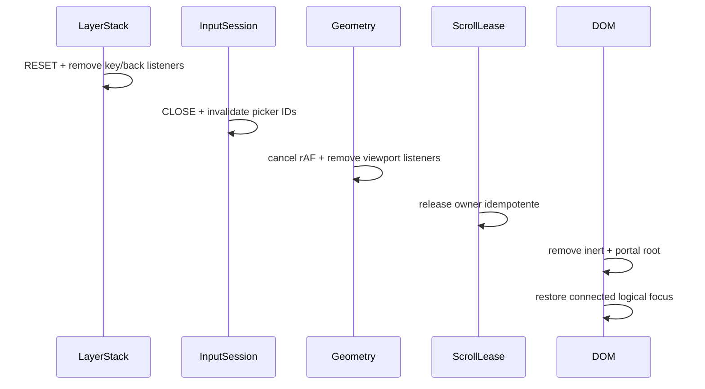

# Máquinas de estado y secuencias V2

**Estado:** especificación; no implementada.  
**Base:** [`manual-editor-v2-architecture.md`](manual-editor-v2-architecture.md).  
**Regla:** las máquinas modelan eventos observables e intención de producto. Ningún estado significa “el teclado está abierto”.

## 1. Vocabulario común

| Término | Significado |
|---|---|
| `focus-observed` | `document.activeElement` coincide con el textarea esperado. No implica OSK. |
| `resume-available` | Existe una interrupción observable o un intento fallido; la UI muestra una acción no bloqueante. |
| `geometry settling` | La última muestra cambió y espera confirmación rAF. No afirma que el UA terminó su animación. |
| `geometry stable` | Dos muestras semánticamente iguales dentro del scheduler. Puede ser invalidada después. |
| `picker external` | Se solicitó UI nativa; el lifecycle siguiente pertenece al UA/SO. |
| `returned-unknown` | La página volvió a primer plano/foco sin `change` ni `cancel` concluyente. |
| `top layer` | Última capa DOM registrada; es la única autorizada a cerrar por Escape/Back/backdrop. |
| `root layer` | Modal manual. Solo cierra cuando no queda una hija. |

## 2. Invariantes de eventos

1. Cada gesto de UI despacha como máximo una transición de capa.
2. Para controles que deben conservar la textarea, el puntero ejecuta una sola transición en `pointerdown` con `preventDefault`; `touchstart` se cancela mediante un listener nativo no pasivo limitado al trigger y su click de compatibilidad se ignora.
3. Teclado y tecnología asistiva ejecutan la misma acción mediante `click` semántico (`detail === 0`); el picker nunca se difiere.
4. Todo evento de picker lleva `transactionId`.
5. `blur`, `window.focus`, `visibilitychange` y un timeout nunca significan commit/cancel por sí solos.
6. Reducers ignoran eventos incompatibles con el estado actual.
7. Cleanup puede ejecutarse más de una vez sin efectos adicionales.

## A. Abrir el editor



### Transiciones

| Estado | Evento | Siguiente | Efecto permitido |
|---|---|---|---|
| cerrado | `OPEN(side)` | opening | Capturar trigger/fallback; crear selecciones vacías por lado. |
| opening | textarea montado | opening | Intentar foco una vez en layout effect. |
| opening | `FOCUS_OBSERVED` | editing | Restaurar rango válido; no concluir OSK. |
| opening | `FOCUS_FAILED` | interrupted | Mostrar la acción contextual dentro de la caja del textarea y bajar el bloque de edición. |
| opening/editing | `GEOMETRY_SAMPLE` | igual | Solo layout; nunca cambia sesión a “teclado”. |
| cualquier abierto | primer `INPUT_OBSERVED` | editing | Retirar ayuda inicial. |

### Resultado observable

- Si aparece OSK, la geometría puede cambiar y la surface se recompone.
- Si no aparece, la caja del textarea sigue visible y muestra una acción contextual para comenzar a escribir; el bloque baja para conservar el patrón móvil validado por producto.
- Después de confirmar una imagen se muestra `Imagen cargada / Toca aquí para seguir escribiendo`, aunque el DOM todavía declare foco: el file picker puede cerrar el OSK sin emitir una señal fiable.
- La acción contextual es el gesto explícito de reanudación; no se reintenta desde timer ni se infiere el OSK.
- Con teclado físico, `beforeinput/input` retira la ayuda y conserva el contenido aunque la superficie contextual esté visible.

### Fallback de geometría

`source=layout-fallback` conserva safe area y scroll. No activa un CTA por sí solo. La entrada determina sesión; la geometría solo determina layout.

## B. Cambiar entre pregunta y respuesta



### Algoritmo

1. Leer `selectionStart`, `selectionEnd` y `selectionDirection` del textarea actual.
2. Guardar `valueLength` y `valueRevision` del lado actual.
3. Si hay composición activa, no reescribir valor; permitir `compositionend` y capturar el rango final antes del cambio efectivo.
4. Despachar `SIDE_REQUESTED(nextSide)`.
5. Renderizar el valor controlado del siguiente lado.
6. Consultar su `SideSelection`.
7. Si revisión y longitud coinciden, acotar y ejecutar `setSelectionRange`.
8. Si no coinciden, usar un caret seguro al final y publicar una nueva selección; nunca aplicar el rango del otro lado.
9. Intentar foco una vez como continuación de la acción; el resultado de OSK sigue unknown.

### Casos de validación

| Caso | Resultado |
|---|---|
| Rango válido, mismo valor | Restauración exacta con dirección. |
| Valor más corto por edición externa | Rango inválido; caret seguro, sin excepción. |
| Mismo largo pero revisión distinta | No restaurar ciegamente. |
| Selección backward | Mantener `selectionDirection='backward'`. |
| Emoji/unidades UTF-16 | Índices se tratan como los entrega textarea; no se reinterpretan por code point. |

## C. Abrir y cerrar un menú DOM

Color predefinido y alineación usan la misma máquina.



### Reglas por evento

| Evento | Acción |
|---|---|
| `pointerdown` primario del trigger | `preventDefault` + `TOGGLE_LAYER(id)` antes de transferir foco; abre, cierra o reemplaza una sola vez. |
| `click` generado por ese puntero | No-op; la transición ya ocurrió. |
| `click` semántico de teclado/AT | Ejecuta el mismo `TOGGLE_LAYER(id)` una sola vez. |
| backdrop | `stopPropagation` + `DISMISS_TOP('backdrop')`. |
| Escape/Back | Coordinador único llama `DISMISS_TOP`. |

Un menú DOM no cambia picker, resume reason ni historia geométrica. No existe `guardKeyboardResumeAfterMenu`.

### Foco

- Pointer con textarea activo: el popover puede mantener foco editorial.
- Apertura con trigger enfocado por teclado/AT: mover foco a la primera acción.
- Cierre: volver al target registrado si sigue conectado y pertenece a la capa propietaria.
- El popover es `role=group`/herramienta etiquetada, no `aria-modal=true`.

## D. Seleccionar color predefinido



### Accesibilidad

- Cada swatch es botón con nombre y `aria-pressed`.
- Enter/Space ejecuta el mismo `click`.
- Si foco estaba dentro de paleta, vuelve al trigger o textarea según la política registrada.
- Un `pointercancel`/drag no aplica color porque la mutación ocurre en `click`.

### Aceptación

- Una mutación de estilo.
- Una capa cerrada.
- Cero eventos de picker.
- Cero resume hint causado por esa acción.

## E. Abrir color personalizado



### Activación

- El control es un botón semántico. En WebKit móvil su `pointerdown` no se cancela: cancelar ese evento suprime el click táctil que debe abrir el sheet.
- El primer click cierra solo la paleta y abre el ActionSheet en la misma pila top-only.
- No existe picker nativo de color ni ruta `showPicker()`/`input.click()`.

### Submáquina



### Borrador y commit

- `input` de sliders y hex actualiza únicamente estado local y preview; 50 movimientos no mutan `qColor/aColor`.
- Aplicar normaliza a `#rrggbb` y realiza exactamente una actualización sobre la clave capturada al abrir.
- Un hex parcial o inválido muestra error local, no aplica y no cierra.

### Cancelación

- Cancelar, backdrop, Escape y Back descartan el mismo borrador y cierran únicamente el sheet superior.
- El color original no necesita restauración porque el modelo nunca se mutó durante la edición.
- El posible cierre del OSK al mover foco al ActionSheet es aceptado; la acción nunca queda sin una transición visual.

## F. Abrir selector de imagen

```mermaid
sequenceDiagram
  participant U as Usuario
  participant T as Toolbar
  participant S as InputSession
  participant I as input file
  participant N as UA/SO
  U->>T: click imagen
  T->>S: abrir ActionSheet con imagen/lado originales
  U->>I: gesto directo en Seleccionar imagen
  I->>N: picker nativo
  alt archivo
    N-->>I: change(files)
    I->>S: preview local; sheet permanece abierto
  else cancel soportado
    N-->>I: cancel
    I->>S: conservar borrador y sheet
  else retorno sin evento
    N-->>S: RETURN_SIGNAL(id)
  end
```

### Resultados

| Resultado | Contenido | Sesión |
|---|---|---|
| Archivo válido | Preview mediante URL temporal; modelo intacto hasta Aplicar. | Draft de picker; sheet abierto. |
| Cancel | Sin cambio. | `cancelled` → editing/interrupted según foco observado. |
| Unknown | Sin supuesto. | `returned-unknown`; resume action disponible, sin timer. |
| Evento tardío de transacción vieja | Sin cambio. | Ignorado por ID. |

Aplicar confirma archivo/destino/eliminación una sola vez. Cancelar no cambia el modelo. Cada URL temporal se revoca al reemplazar archivo, cancelar o desmontar. No se guarda tarjeta, cierra modal ni limpia selección por `window.focus`.

## G. Rotar con el editor abierto



### Secuencia

1. `window.resize` invalida; no publica `keyboardOpen`.
2. El sampler lee layout y VisualViewport completos.
3. Cambio de orientación crea nueva epoch y descarta comparación con portrait.
4. Surface y overlay root reciben el mismo snapshot.
5. Safe area top/left/right/bottom se recompone por CSS.
6. Main conserva scroll dentro de límites; textarea conserva valor.
7. Popover abierto se reancla o se cierra de forma recuperable si no cabe.
8. Segunda muestra igual estabiliza.
9. Retorno a portrait repite el proceso; no recupera baseline histórico.

### Política de popover durante settling

- No abrir uno nuevo hasta tener target y snapshot válidos.
- Uno ya abierto puede ocultarse visualmente durante un frame de settling y reaparecer reanclado, sin perder estado.
- Si el anchor desaparece, dismiss top con razón `anchor-lost` y restaura foco lógico.

## H. Escape, Back y cierre por capas



### Orden

1. Picker nativo abierto: el UA/SO decide primero; la web no intercepta su Escape/Back interno.
2. Paleta o alineación DOM: cerrar solo esa capa.
3. ActionSheet registrado superior: cerrar solo sheet.
4. Modal manual: cerrar modal.
5. Sin capas: permitir navegación real.

### Sentinel de historia

| Caso | Comportamiento |
|---|---|
| Abrir editor | `pushState` de un sentinel con token único y URL actual. |
| Back con hija | `popstate` cierra hija y vuelve a insertar un sentinel para la raíz restante. |
| Back con solo raíz | `popstate` cierra raíz y no rearma. |
| Escape/backdrop de hija | Cierra hija; sentinel raíz permanece. |
| Botón/Escape de raíz | Solicita consumir sentinel; termina cierre al recibir `popstate`. |
| Unmount externo/pagehide | Limpia listener/registro; no llama navegación adicional durante pagehide. |

El adapter debe conservar el `history.state` previo dentro del sentinel, no sustituir datos ajenos. Si la aplicación añade router, el adapter se integra con su API antes de activar V2; no se permiten dos propietarios de historia.

## I. Cierre y desmontaje



### Orden obligatorio

1. Marcar sesión `closing` para ignorar callbacks de picker tardíos.
2. Resetear capas y desactivar handlers de cierre.
3. Cancelar rAF geométrico y cualquier rAF de foco/posición.
4. Retirar VisualViewport/window/document listeners y observers.
5. Liberar lease; el último owner restaura scroller e inert.
6. Desmontar portal.
7. Resolver foco de retorno:
   - target original conectado y fuera de un subtree inert;
   - si no, trigger del lado en `FormInputs`;
   - si no, control lógico del creator;
   - nunca `body` ni nodo desconectado.
8. Foco y rango se restauran por separado. Un error de selección no repite `focus()`.

### Cleanup verificable

| Recurso | Propietario | Condición final |
|---|---|---|
| VV resize/scroll + window resize | geometry hook | 0 listeners del instance ID |
| rAF geométrico | geometry hook | cancelado o ejecutado antes de close |
| Escape/popstate | layer hook | 0 listeners del instance ID |
| registry callbacks | layer hook | Map vacío |
| picker transaction | session reducer | ID invalidado; eventos tardíos no-op |
| scroll owner/inert | scrollLock | owner ausente; originales restaurados al último |
| portal node | React | no conectado |
| foco | FormInputs/modal boundary | un destino lógico o ninguno deliberado |

## 3. Eventos prohibidos como certeza

| Señal | Uso permitido | Uso prohibido |
|---|---|---|
| `activeElement` | foco DOM observado | OSK visible |
| `VisualViewport` reducido | layout/oclusiones geométricas | “teclado abierto” |
| `window.focus` | retorno posible de UI externa | picker cancelado |
| `blur` | foco cambió | picker terminó / OSK cerrado |
| 80/250/450 ms | ninguno en estas máquinas | prueba de UA |
| `dvh` | fallback de layout | altura sobre IME |
| `preventScroll` sin excepción | intento aceptado | ausencia de scroll Android |

## 4. Relación con pruebas

Cada transición tiene cobertura en [`manual-editor-v2-test-plan.md`](manual-editor-v2-test-plan.md):

- A/G: `UT-GEO-*`, `PW-OPEN-001`, `PW-GEO-001` y dispositivos `DEV-IOS/AND/WV`.
- B: `UT-SES-002/003` y `PW-SIDE-001`.
- C/D: `UT-LAY-001/002` y `PW-MENU-001`.
- E/F: `UT-PICK-*`, `PW-PICK-*` y pickers físicos.
- H: `UT-LAY-003/004`, `PW-ESC-001`, `PW-BACK-001`.
- I: `UT-LIFE-*` y `PW-LIFE-001`.
